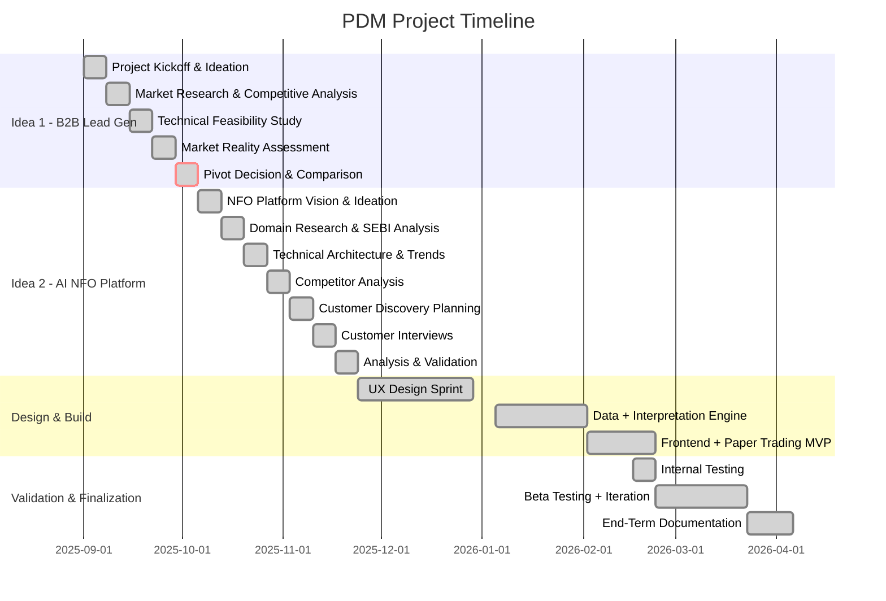
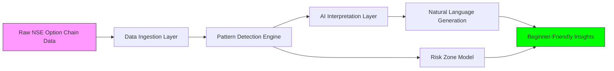
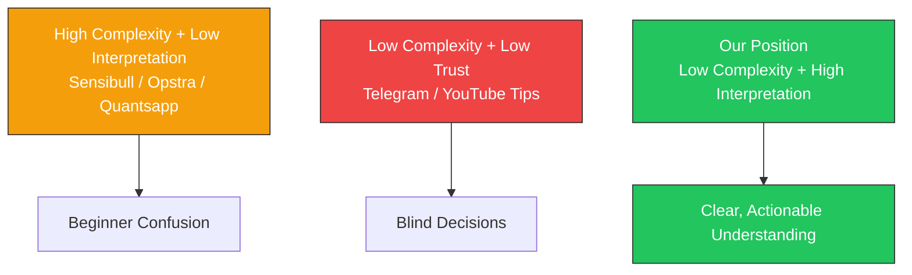

# PDM Project: AI-Assisted NFO Interpretation Platform

**Team Members:**
- Pooja Rani Maloth (2024204019)
- Jayant Anand Jha (2024204018)

## Project Overview

This repository documents the weekly progress of our Product Design & Management (PDM) course project. The project evolved from early ideation and pivot (Weeks 1-12) into design, development, testing, and finalization (Weeks 13-31) for an **AI-Assisted NFO Interpretation Platform** for retail traders in India.

## Project Timeline



## The Problem

Over **90% of retail F&O traders in India lose money** every year. The primary reason is not a lack of data, but a **lack of interpretation**. Existing tools like Sensibull, Opstra, and Quantsapp display raw option chain data (OI, COI, IV, PCR, Volume) but none of them explain **what it means** in simple language.

## Our Solution

An AI-driven interpretation platform that:
- Reads option chain data like an experienced trader
- Explains market behaviour, directional bias, and institutional intent
- Highlights safe vs. risky strike zones
- Delivers insights in plain, beginner-friendly language



## Repository Structure

```
PDM Project/
├── README.md
├── weekly-progress/
│   ├── week-01.md    # Project kickoff, B2B Lead Gen ideation
│   ├── week-02.md    # Market research, competitive landscape
│   ├── week-03.md    # Technical feasibility study
│   ├── week-04.md    # Market reality findings
│   ├── week-05.md    # Pivot decision & idea comparison
│   ├── week-06.md    # NFO platform ideation & vision
│   ├── week-07.md    # Domain research, SEBI data
│   ├── week-08.md    # Technical aspects & industry trends
│   ├── week-09.md    # Competitor analysis
│   ├── week-10.md    # Customer discovery planning
│   ├── week-11.md    # Customer interviews conducted
│   ├── week-12.md    # Interview analysis & validation
│   ├── week-13.md ... week-18.md  # Post-mid-eval UX design phase
│   ├── week-19.md ... week-25.md  # MVP build and internal testing
│   └── week-26.md ... week-31.md  # Beta, iteration, and final submission
└── research/
    ├── interview-uma-transcript.txt
    ├── interview-lakhu-bhai-transcript.txt
    └── interview-saurabh-shukla-transcript.txt
```

## Key Findings

| Metric | Value |
|--------|-------|
| Retail F&O Traders in India | 2.4+ crore (2025-26) |
| Growth Since 2019 | 500% |
| Traders Who Lose Money | 91-93% (SEBI) |
| Average Loss Per Trader | Rs 1.05-1.8 lakh/year |
| Primary Cause | Lack of data interpretation |

## Competitive Gap



## Customer Validation Summary

We conducted **3 in-depth interviews** with active F&O traders (Uma, Lakhu Bhai, Saurabh Shukla) and validated:
- Traders struggle to interpret OI/COI/IV data
- Existing dashboards overwhelm beginners
- Traders rely on instinct, tips, or influencers rather than data analysis
- Strong willingness to pay for a tool with 90-95% prediction accuracy
- Paper trading feature is highly desired for trust-building

## Course

Product Design & Management (PDM) - Fall 2025
