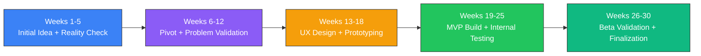
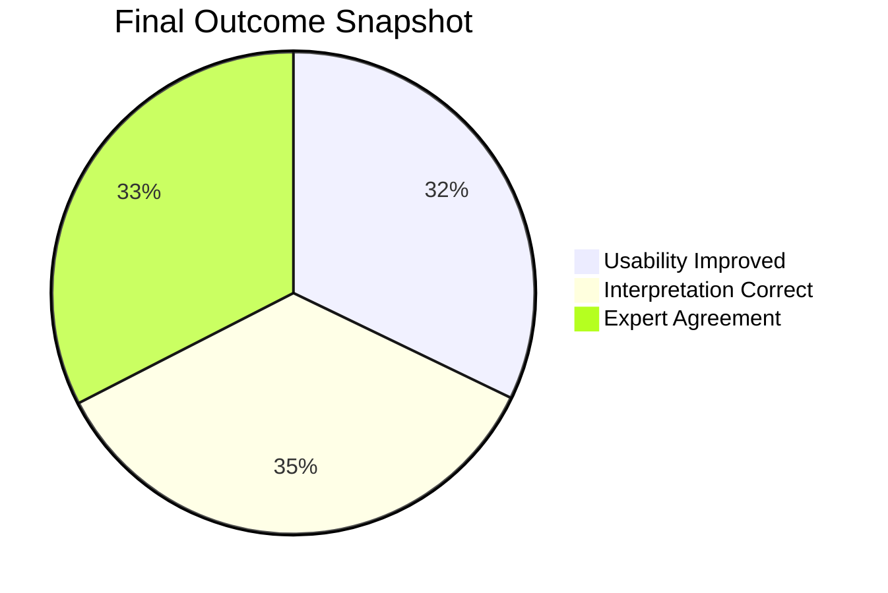

# Final Project Report

**Project:** AI-Assisted NFO Interpretation Platform  
**Course:** Product Design & Management (PDM), Fall 2025  
**Team:** Pooja Rani Maloth (2024204019), Jayant Anand Jha (2024204018)  
**Reporting Window:** Week 1 to Week 30 (Sep 2025 to Mar 2026)

---

## 1) Executive Summary

This project started with an initial B2B lead-generation concept and pivoted by Week 5 to a higher-impact, more feasible problem: helping retail options traders interpret complex option-chain data.

The final solution is a mobile-first AI interpretation layer that translates OI/COI/IV/PCR signals into plain language, highlights risk zones (Safe/Caution/Danger), and provides a paper-trading learning loop. Across usability and beta cycles, the product showed measurable improvements in clarity, confidence, and decision hygiene.

---

## 2) Problem Statement

Retail F&O users have access to data but not understanding. Existing platforms are feature-rich but hard for beginners, which pushes many users toward risky tip channels.

**Core HMW:**
How might we close the interpretation gap at the exact moment a user sees option-chain numbers but cannot decode risk, so they can make informed decisions instead of relying on unreliable tips?

---

## 3) Project Journey

---

## 4) Methods Used

- Secondary research: SEBI findings, competitor studies, product/market feasibility checks
- Customer discovery: trader interviews and persona synthesis
- Design process: user journey mapping, IA, low-fi and high-fi prototypes
- Build process: backend ingestion + interpretation engine + NLG + frontend MVP
- Validation: usability testing, internal QA, beta cohorts with comparative metrics

---

## 5) Key Deliverables

- 30 weekly progress reports (`week-01.md` to `week-30.md`)
- Mid-term evidence and framing (`PDM Project Mid Evals.pdf`)
- 3 primary interview transcripts in `research/`
- MVP modules documented across build weeks:
  - Data ingestion and normalization
  - Rule-based interpretation engine (OI/COI/IV/PCR)
  - Narrative generation layer (beginner-friendly output)
  - Risk zone model
  - Paper trading workflow

---

## 6) Outcomes (Measured)

| Area | Result |
|------|--------|
| UX usability | SUS improved from 74 to 82 across iterations |
| Interpretation quality | ~90% factual correctness in internal checks |
| Expert alignment | ~83% agreement with expert interpretation samples |
| Behavior signal | Reduced blind-tip dependency in beta users |
| Task completion | Strong gains after iteration, especially in paper-trading flow |

---

## 7) What Worked Well

- Narrative-first UI (plain language before charts) consistently improved comprehension
- Risk zone visualization enabled faster and safer decision screening
- Paper trading increased trust and converted confusion into practice
- Iteration loops (Beta-1 -> fixes -> Beta-2) produced measurable retention and success improvements

---

## 8) Constraints and Risks

- Limited beta sample sizes (directional, not definitive)
- Snapshot feed latency limits ultra-short-term responsiveness
- Regulatory/compliance boundaries for advice-like language require caution
- Advanced users requested deeper analytics, which was intentionally deferred for v1 simplicity

---

## 9) Final Conclusion

The project successfully progressed from problem discovery to a validated MVP. The strongest evidence is not only feature completion, but improved decision clarity for target users at the exact failure point identified in discovery.

The product demonstrates clear educational and risk-awareness value for beginner and early-intermediate retail options traders.

---

## 10) Recommended Next Steps (V2)

1. Expand beta cohort and observation window for stronger statistical confidence
2. Add multilingual narratives (starting with Hindi)
3. Improve adaptive risk scoring (time-of-day, expiry proximity, liquidity weighting)
4. Add configurable advanced mode for intermediate users
5. Formalize compliance review for narrative wording and recommendation boundaries

---

## 11) File References

- `README.md`
- `weekly-progress/week-01.md`
- `weekly-progress/week-12.md`
- `weekly-progress/week-18.md`
- `weekly-progress/week-25.md`
- `weekly-progress/week-30.md`
- `weekly-progress/PDM Project Mid Evals.pdf`
- `research/interview-uma-transcript.txt`
- `research/interview-lakhu-bhai-transcript.txt`
- `research/interview-saurabh-shukla-transcript.txt`
