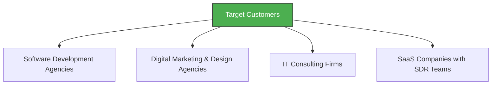

# Week 1: Project Kickoff & B2B Lead Generation Ideation

**Date:** September 1 - September 6, 2025  
**Team:** Pooja Rani Maloth (2024204019), Jayant Anand Jha (2024204018)

---

## Objectives

- Form the project team and align on PDM course expectations
- Brainstorm initial product ideas based on team expertise and market opportunity
- Select a primary idea to explore in depth over the coming weeks
- Define the initial product vision and target customer segments

## Activities

- **Team Formation:** Pooja and Jayant finalized the team. Discussed individual strengths -- Jayant has experience in trading and tech, Pooja brings strong analytical and research skills.
- **Brainstorming Session:** Explored 4-5 product ideas across fintech, SaaS, and AI-driven tools. Evaluated each against basic criteria: market size, technical feasibility, personal expertise.
- **Idea Selection:** Converged on **AI-Powered B2B Lead Generation Platform** as the primary idea to explore.
- **Vision Drafting:** Drafted the initial product vision statement for an autonomous B2B lead generation engine.

## Research Findings

### Initial Product Vision
The vision was to build an AI-powered, autonomous B2B lead generation engine that automates end-to-end:
- **Prospecting** - Identifying potential leads across channels
- **Qualification** - Filtering and scoring leads using AI
- **Outreach** - Personalized email and message sequences
- **Nurturing** - Conversational engagement until sales-ready

Human involvement would only be required in final contractual stages.

### Target Customer Segments Identified

These companies rely heavily on predictable lead flow and spend substantial time on manual qualification and repetitive outreach.

## Insights

- The B2B lead generation space is massive and has clear, well-defined pain points
- Companies spend significant budgets on SDR teams and outbound tools
- The idea of "autonomous" end-to-end lead gen seemed like a strong differentiator at this stage
- Team enthusiasm was high as the problem resonated with our understanding of sales workflows

## Challenges

- Needed to validate whether the market truly needs *another* lead generation tool
- Unclear how deep the competitive moat would be for incumbents
- Limited domain access to actual B2B sales teams for quick validation

## Next Week Plan

- Conduct in-depth competitive landscape analysis (Apollo, Outreach, ZoomInfo, HubSpot, etc.)
- Map out the initial product idea in more detail (features, capabilities)
- Begin assessing market saturation and barriers to entry
