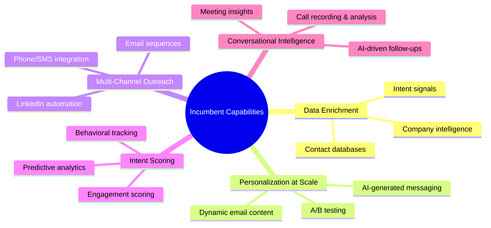

# Week 2: Market Research & B2B Competitive Landscape

**Date:** September 8 - September 13, 2025  
**Team:** Pooja Rani Maloth (2024204019), Jayant Anand Jha (2024204018)

---

## Objectives

- Map the competitive landscape for B2B lead generation tools
- Understand what existing solutions already offer
- Identify potential gaps or opportunities for differentiation
- Detail the initial product idea's feature set

## Activities

- **Competitive Research:** Conducted deep-dive analysis of 8+ tools in the B2B lead generation space, both global and Indian
- **Feature Mapping:** Documented what each competitor offers across key dimensions
- **Product Capability Definition:** Outlined the intended capabilities for our system
- **Literature Review:** Read industry reports on B2B SaaS sales automation trends

## Research Findings

### Competitive Landscape

| Competitor | Category | Key Strengths |
|-----------|----------|---------------|
| Apollo.io | Global | Data enrichment, sequencing, huge database |
| Outreach | Global | Multi-channel outreach, AI-powered sequencing |
| ZoomInfo | Global | Intent data, massive B2B database |
| HubSpot | Global | Full CRM suite, marketing + sales alignment |
| Salesforce | Global | Enterprise CRM, ecosystem dominance |
| LeadSquared | India | India-focused, good for mid-market |
| EasyLeadz | India | Indian B2B data provider |
| Lusha | Global | Contact data enrichment |

### Capabilities Already Offered by Incumbents

### Our Proposed Product Capabilities

The system's intended capabilities were:
1. Automated lead discovery across multiple channels
2. AI-driven filtering and scoring
3. Automated personalized emails and message sequences
4. Multi-touch outreach across email, LinkedIn, and phone
5. Conversational nurturing via AI
6. Automated handoff of sales-ready leads

**Proposed Differentiator:** End-to-end autonomy rather than partial automation.

## Insights

- The competitive space is **extremely mature** with well-funded global players
- Most incumbents already offer some level of AI-powered automation
- Apollo and Outreach have recently introduced autonomous sequencing features
- Indian tools like LeadSquared are catching up but focused more on CRM than prospecting
- The "end-to-end autonomy" angle might not be as unique as initially thought

## Challenges

- Incumbents have massive datasets (millions of contacts) that would be impossible to replicate
- Compliance requirements (GDPR, CAN-SPAM) add significant complexity
- The ecosystem is deeply integrated -- companies already use these tools with their CRMs
- Switching costs for customers are very high

## Next Week Plan

- Assess technical feasibility and infrastructure requirements
- Evaluate data acquisition costs and compliance challenges
- Begin questioning whether this idea is truly viable for a student-led project
