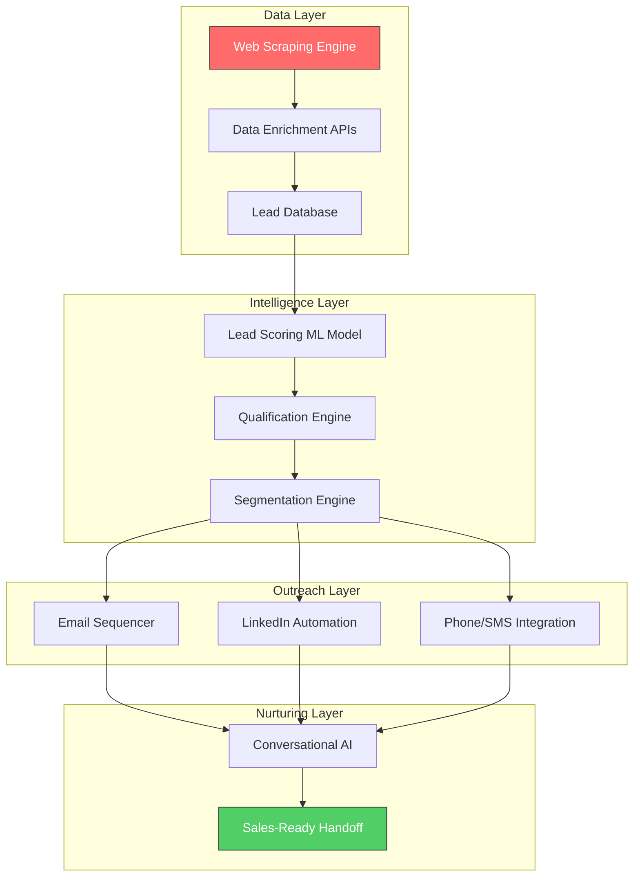

# Week 3: B2B Lead Generation - Technical Feasibility Study

**Date:** September 15 - September 20, 2025  
**Team:** Pooja Rani Maloth (2024204019), Jayant Anand Jha (2024204018)

---

## Objectives

- Evaluate the technical feasibility of building an autonomous B2B lead generation engine
- Understand infrastructure and data requirements
- Assess compliance and legal challenges
- Determine whether this is achievable within academic project constraints

## Activities

- **Technical Architecture Research:** Studied how tools like Apollo and Outreach are architected
- **Data Source Evaluation:** Investigated B2B data providers, web scraping legality, and data enrichment APIs
- **Compliance Analysis:** Reviewed GDPR, CAN-SPAM, and Indian IT Act requirements for automated outreach
- **Infrastructure Cost Estimation:** Estimated cloud, API, and data costs for an MVP

## Research Findings

### Technical Architecture Requirements

### Key Technical Challenges Identified

| Challenge | Severity | Details |
|-----------|----------|---------|
| Data Acquisition | High | Building a B2B contact database requires expensive APIs or scraping infrastructure |
| Data Compliance | Critical | GDPR, CAN-SPAM, and Indian regulations impose strict rules on automated outreach |
| Email Deliverability | High | Maintaining sender reputation requires domain warming, SPF/DKIM setup, dedicated IPs |
| AI Training Data | High | Training lead scoring models requires historical conversion data we don't have |
| CRM Integration | Medium | Customers expect integration with Salesforce, HubSpot, etc. |
| Infrastructure Costs | High | Real-time scraping, ML inference, email sending at scale requires significant cloud spend |

### Cost Estimates for MVP

| Component | Monthly Cost (Est.) |
|-----------|-------------------|
| Data enrichment APIs (Clearbit, Hunter) | $200-500/mo |
| Cloud infrastructure (AWS/GCP) | $150-300/mo |
| Email sending service (SendGrid) | $50-100/mo |
| LinkedIn automation tools | $100-200/mo |
| ML model hosting | $100-200/mo |
| **Total Estimated** | **$600-1,300/mo** |

This is prohibitively expensive for a student project without external funding.

## Insights

- Building a competitive B2B lead generation tool requires **significant capital investment** in data, infrastructure, and compliance
- The data moat of incumbents is nearly impossible to overcome -- Apollo has 250M+ contacts
- Even with AI, without access to proprietary training data, our lead scoring would be inferior
- Compliance requirements alone add months of development effort
- The technical complexity is "Very High" -- this is essentially an enterprise SaaS product

## Challenges

- No access to real B2B lead data for training or testing
- Cost of running the platform would exceed project budget
- Legal risks around automated outreach without proper compliance framework
- Would require partnerships with data providers that are unlikely for an academic project

## Next Week Plan

- Conduct final market reality assessment
- Begin formally evaluating whether this idea should be continued or pivoted
- Research alternative product ideas that are more feasible within constraints
