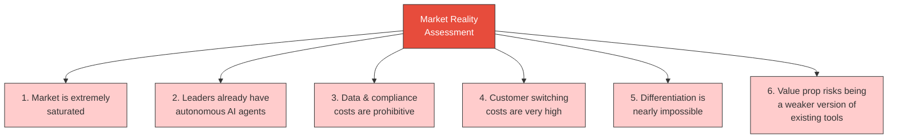

# Week 4: Market Reality Assessment & Early Pivot Signals

**Date:** September 22 - September 27, 2025  
**Team:** Pooja Rani Maloth (2024204019), Jayant Anand Jha (2024204018)

---

## Objectives

- Consolidate all market research findings into a clear market reality picture
- Identify specific barriers to entry and viability constraints
- Begin evaluating alternative product ideas as potential pivot candidates
- Document findings for pivot decision framework

## Activities

- **Market Reality Synthesis:** Compiled all research from Weeks 1-3 into a structured assessment
- **Barrier Analysis:** Documented 6 key market reality findings that challenge the original idea
- **Alternative Idea Exploration:** Began exploring other domains where AI could solve real problems with lower barriers
- **Feasibility Discussion:** Had a team discussion on whether to persist or pivot

## Research Findings

### Six Key Market Reality Findings

### Detailed Findings

1. **Market Saturation:** The space is led by highly funded global players (Apollo raised $100M+, Outreach raised $489M). Competing head-to-head is not realistic.

2. **Autonomous AI Already Exists:** Market leaders have already introduced autonomous sequencing, AI-generated emails, and intent-based triggers. Our "differentiator" is already being shipped.

3. **Data & Compliance Costs:** Acquiring B2B contact data, maintaining compliance (GDPR, CAN-SPAM), and building email infrastructure requires capital we don't have.

4. **High Switching Costs:** Companies deeply integrate lead gen tools with their CRMs (Salesforce, HubSpot). Convincing them to switch is extremely difficult.

5. **Differentiation is Difficult:** Without access to large datasets and sophisticated infrastructure, any product we build would be inferior to what exists.

6. **Weak Value Proposition:** Our product risks becoming a "weaker version of existing enterprise tools" rather than something genuinely new.

### Alternative Ideas Under Consideration

During team discussions, we began exploring alternative spaces:
- AI for stock market data interpretation (especially India's growing retail trader base)
- AI-powered content generation for regional languages
- Student expense management platform
- AI tutoring for competitive exam prep

Jayant's experience with F&O trading made the stock market idea particularly interesting, as he had first-hand knowledge of the interpretation gap facing retail traders.

## Insights

- The B2B lead gen idea fails on multiple critical dimensions: market saturation, cost, differentiation, and feasibility
- Although the problem is valid, the solution space is too crowded for a student project
- The team's domain expertise aligns much better with the fintech/trading space
- India's retail trading market (2.4 crore+ F&O traders) presents a large, underserved audience
- The emotional pain of losing money in trading is a much stronger driver than B2B sales efficiency

## Challenges

- Accepting that 4 weeks of work on the original idea needs to be shelved
- Ensuring the pivot decision is data-driven, not impulsive
- Need to find an idea that is feasible within academic constraints while still addressing a real problem

## Next Week Plan

- Formally make the pivot decision with a structured comparison framework
- Define evaluation criteria for comparing the two ideas
- Begin fleshing out the new idea if the pivot is confirmed
