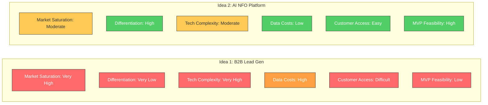

# Week 5: Pivot Decision & Structured Idea Comparison

**Date:** September 29 - October 4, 2025  
**Team:** Pooja Rani Maloth (2024204019), Jayant Anand Jha (2024204018)

---

## Objectives

- Make a formal, data-driven pivot decision
- Define clear evaluation criteria for comparing both ideas
- Create a structured comparison framework
- If pivoting, articulate the rationale clearly and document it

## Activities

- **Evaluation Framework Design:** Defined 8 evaluation dimensions to compare both ideas objectively
- **Structured Comparison:** Scored each idea against all criteria
- **Pivot Rationale Documentation:** Wrote a clear rationale for why the pivot is necessary
- **New Idea Selection:** Formally selected the AI-Assisted NFO Interpretation Platform as the new direction
- **Transition Planning:** Outlined what needs to happen in the coming weeks for the new idea

## Research Findings

### Evaluation Criteria & Comparison

### Full Comparison Table

| Evaluation Dimension | Idea 1: B2B Lead Gen | Idea 2: AI NFO Platform |
|---------------------|---------------------|------------------------|
| Market Saturation | Very High | Moderate |
| Differentiation Potential | Very Low | High |
| Technical Complexity | Very High | Moderate |
| Data Costs | High | Low |
| Customer Access | Difficult | Easy |
| MVP Feasibility | Low | High |
| Value Creation | High but highly competed | High and underserved |
| Suitability for Student Project | Weak | Strong |

### Why The Pivot Was Necessary

The pivot decision was driven by the combination of:
1. **Market saturation** -- the space is dominated by well-funded global players
2. **Technical infeasibility** -- building a competitive product requires enterprise-level resources
3. **Limited differentiation** -- our "autonomous" differentiator is already being shipped by incumbents

### Why The New Idea Was Selected

The AI-assisted NFO interpretation platform was selected because:
- It addresses a clearly validated, high-pain problem for a large retail market
- Existing tools focus on data display, not interpretation, leaving a strong gap
- Strong potential for differentiation through AI-based reasoning and risk-zone frameworks
- Data required for MVP is accessible through vendors (Global Datafeeds, TrueData)
- Retail traders are easy to access for interviews and validation
- Technically feasible and well-suited for a one-year project

## Insights

- **Strategic pivots are a sign of good product thinking**, not failure. Recognizing a dead-end early saves months of wasted effort.
- The new idea scores significantly better across all 8 evaluation dimensions
- Jayant's personal experience with F&O trading provides authentic domain knowledge
- The Indian retail trading market (2.4 crore traders, 500% growth since 2019) represents a massive underserved opportunity
- The SEBI finding that 91-93% of retail traders lose money validates the severity of the problem

## Challenges

- Transitioning mentally from an idea we had invested 4 weeks into
- Ensuring we don't lose momentum during the pivot
- Need to ramp up domain knowledge on F&O/NFO trading quickly

## Next Week Plan

- Begin defining the product vision for the AI-Assisted NFO Interpretation Platform
- Identify potential customer segments in the retail trading space
- Draft the primary need/opportunity statement
- Start domain research on Indian F&O market
