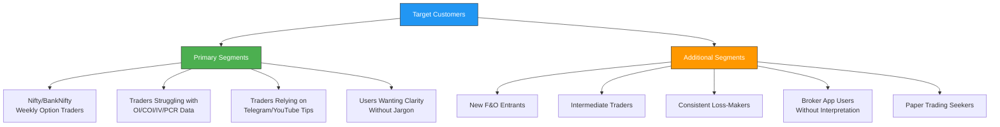

# Week 6: NFO Platform - Product Vision, Segments & Opportunity

**Date:** October 6 - October 11, 2025  
**Team:** Pooja Rani Maloth (2024204019), Jayant Anand Jha (2024204018)

---

## Objectives

- Define the product/business vision for the AI-Assisted NFO Interpretation Platform
- Identify and segment potential customers
- Articulate the primary need/opportunity statement
- Define the initial product idea and key customer benefits

## Activities

- **Vision Statement Drafting:** Crafted a clear, compelling product vision
- **Customer Segmentation:** Identified primary and secondary customer segments through market analysis
- **Need/Opportunity Analysis:** Studied SEBI reports and retail trading statistics to understand the problem depth
- **Product Idea Definition:** Outlined the core system capabilities
- **Benefit Mapping:** Mapped product features to specific customer pain points

## Research Findings

### Product Vision Statement

> To build an AI-assisted NFO interpretation platform that reads option chain data like an experienced trader and explains market behaviour, directional bias, institutional intent, and risk zones in simple, intuitive language. The goal is to empower new retail traders with clear, actionable understanding -- reducing blind trading, confusion, and unnecessary losses.

### Customer Segments

### Primary Need / Opportunity

Retail traders face a large knowledge and interpretation gap in F&O trading. While most tools display raw data, **over 90% of retail F&O traders still lose money every year**, largely due to:

- Inability to understand OI, COI, IV, PCR, Volume, and institutional activity
- Lack of clarity on *why* markets move a certain way
- Blind trading driven by influencers or tips
- Misreading market sentiment and risk levels

### Hidden Contributors Traders Need Help With

| Factor | What Traders Miss |
|--------|------------------|
| Market Sentiment | Whether the overall market mood is bullish, bearish, or neutral |
| Time Decay | How expiry proximity affects option premiums |
| Expiry Sensitivity | Increased volatility and risk near expiry dates |
| News Impact | How macro events affect specific strikes |
| Underlying Price Sensitivity | How Nifty/BankNifty movements cascade to option prices |

### Initial Product Idea

An AI-driven interpretation and analytics system that:
1. Processes raw option-chain data from NSE
2. Applies proprietary rules to detect market intent
3. Identifies support/resistance, trend direction, and risk zones
4. Incorporates factors like time decay, sentiment, news, and expiry behavior
5. Converts signals into clean, actionable insights
6. Explains reasoning (e.g., "High COI build-up on Calls at 22500 indicates strong resistance")
7. Optionally supports paper trading (if SEBI-compliant)

**The product becomes a personal AI trading assistant -- not just another data dashboard.**

### Key Customer Benefits

- Clear understanding of NFO data without needing financial expertise
- Avoidance of risky trades using a proprietary risk-zone model
- Time savings by eliminating manual OI/IV/Volume analysis
- Decisions backed by interpreted, not raw, data
- Natural, guided learning through insights
- Greater confidence and reduced anxiety during trading
- Improved discipline and long-term skill-building

## Insights

- The opportunity is significant because existing tools serve data to experts but ignore the 90%+ who can't interpret it
- The product doesn't compete on "more data" -- it competes on **clarity and interpretation**
- The "mentor-like" positioning resonates strongly -- traders want someone to explain things simply
- Paper trading could be a powerful trust-building mechanism (if SEBI allows)
- The emotional angle (reducing anxiety, avoiding losses) is as important as the functional angle

## Challenges

- Need to clearly define what "interpretation" means technically -- how do we translate OI data into plain language?
- SEBI compliance for paper trading needs investigation
- Balancing simplicity for beginners with depth for intermediate traders

## Next Week Plan

- Deep-dive into the NFO/F&O domain (market stats, SEBI data, terminology)
- Define key differentiators vs. competitors
- Research competitive alternatives in detail
