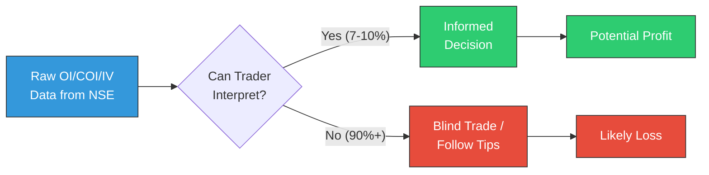

# Week 7: Domain Deep-Dive, Market Stats & Key Differentiators

**Date:** October 13 - October 18, 2025  
**Team:** Pooja Rani Maloth (2024204019), Jayant Anand Jha (2024204018)

---

## Objectives

- Conduct a thorough domain overview of NFO/F&O trading in India
- Compile market data and SEBI statistics to quantify the problem
- Define the key differentiators that set our product apart
- Research competitive alternatives at a high level

## Activities

- **SEBI Report Analysis:** Studied SEBI's report on retail trader losses in F&O markets
- **Market Statistics Compilation:** Gathered data on retail participation, growth trends, and loss patterns
- **Differentiator Definition:** Defined 7 key differentiators for our platform
- **Competitive Alternatives Survey:** Catalogued existing tools and their positioning
- **Terminology Documentation:** Built a reference of key F&O terms (OI, COI, IV, PCR, etc.) for team reference

## Research Findings

### Market Snapshot: NFO/F&O Trading in India

| Insight | Details |
|---------|---------|
| Retail Participation | 2.4+ crore retail F&O traders (2025-26) |
| Growth | 500% increase since 2019 |
| SEBI Finding | 91-93% of retail traders lose money |
| Average Loss | Rs 1.05-1.8 lakh per trader/year |
| Primary Reason for Loss | Lack of interpretation of OI/IV/COI/Volume; impulsive trading |

### The Core Problem Visualized

### 7 Key Differentiators

1. **AI Interpretation Engine:** Reads OI/COI/IV/Volume patterns and explains market behaviour in real time -- no other tool does this
2. **Safe Zone Model:** Proprietary model highlighting stable vs. dangerous strike levels for each expiry
3. **Narrative Insights:** Human-style explanations like "Market sentiment is weakening because heavy put unwinding at 22400 suggests support is breaking"
4. **Noise Reduction Algorithm:** Instead of showing 50+ data points, surfaces only the 2-3 insights that truly matter right now
5. **Beginner-Friendly Interface:** No jargon, no complexity, no overwhelm -- designed for people who don't know what OI means
6. **Optional Paper Trading:** Lets traders practice safely and verify platform's accuracy before using real money (SEBI compliance required)
7. **Mentor-Like Learning:** Helps traders understand *why* the market is behaving a certain way, not just *what* is happening

### Competitive Alternatives Overview

| Tool | Positioning | Our Advantage |
|------|------------|---------------|
| Sensibull | Advanced analytics for intermediate traders | Too complex for beginners, no AI interpretation |
| Opstra | Professional-grade OI/IV/Greeks analytics | Technical, chart-heavy, no simple explanations |
| Quantsapp | 25-70+ tools for advanced traders | Overwhelming, needs prior F&O knowledge |
| Broker Apps | Basic OI display within trading apps | Raw data only, no explanation or risk zones |
| Telegram/YouTube | Tips and advice from influencers | Unreliable, unregulated, high-risk |

### Key F&O Terminology Reference

| Term | Full Form | What It Means |
|------|-----------|---------------|
| OI | Open Interest | Total outstanding contracts at a strike price |
| COI | Change in Open Interest | How OI changed in the current session |
| IV | Implied Volatility | Market's expectation of future price movement |
| PCR | Put-Call Ratio | Ratio of put OI to call OI -- indicates market sentiment |
| Max Pain | Maximum Pain | Strike where option writers lose the least |
| Greeks | Delta, Gamma, Theta, Vega | Sensitivity measures for option pricing |

## Insights

- The market size is enormous (2.4 crore traders) and growing at 500% -- this is a massive TAM
- The 91-93% loss rate means the problem is not just common, it's **systemic** -- the market desperately needs better tools
- No existing product addresses the interpretation gap for beginners -- this is a genuine white space
- Our differentiators are defensible because they require domain expertise + AI/NLP -- not just engineering
- The "noise reduction" angle is particularly compelling -- traders are drowning in data, not starving for it

## Challenges

- Need to validate differentiators through customer conversations (not just desk research)
- SEBI compliance for paper trading is still unclear -- need to investigate further
- Defining the "Safe Zone Model" requires deep domain expertise in options pricing

## Next Week Plan

- Deep-dive into technical aspects: data infrastructure, AI/ML trends, architecture planning
- Research data vendor options (Global Datafeeds, TrueData)
- Begin planning the technical architecture
