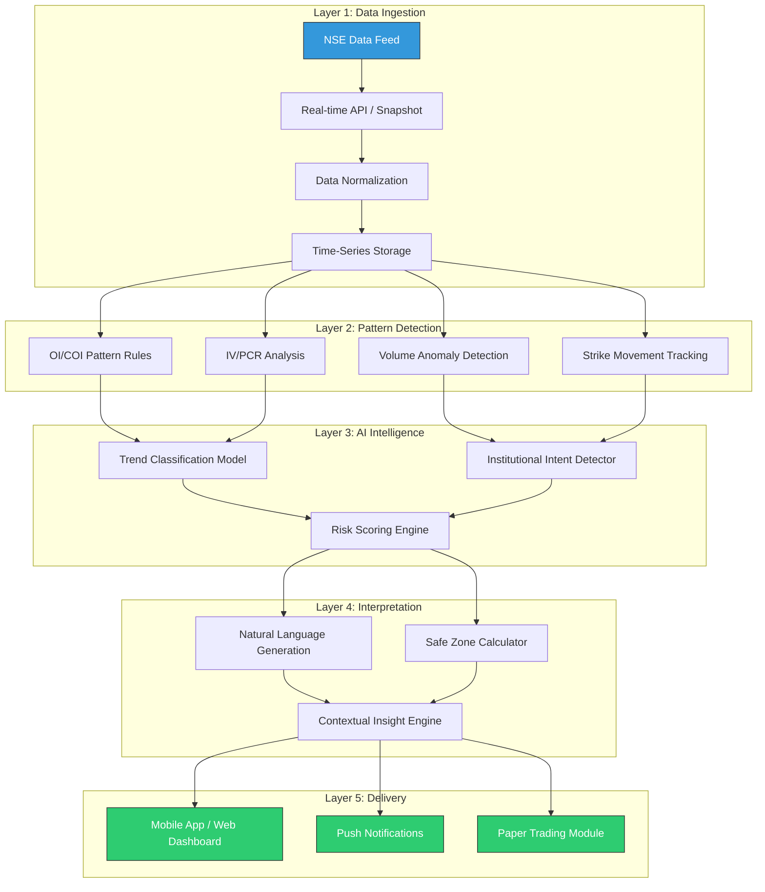

# Week 8: Technical Aspects, AI/ML Trends & Architecture Planning

**Date:** October 20 - October 25, 2025  
**Team:** Pooja Rani Maloth (2024204019), Jayant Anand Jha (2024204018)

---

## Objectives

- Research data infrastructure options for real-time F&O data
- Study AI/ML trends relevant to trading and financial interpretation
- Design the preliminary technical architecture for the platform
- Analyze UX trends in modern trading applications

## Activities

- **Data Vendor Research:** Evaluated NSE data access options, licensed vendors, and API providers
- **AI/ML Trend Analysis:** Studied current trends in algorithmic trading, pattern recognition, and explainable AI
- **Architecture Design:** Created a 5-layer technical architecture for the platform
- **UX Research:** Analyzed design patterns in successful trading apps
- **Cost Estimation:** Estimated data and infrastructure costs for MVP development

## Research Findings

### Data & Infrastructure Landscape

| Area | Industry Reality | Implication for Us |
|------|-----------------|-------------------|
| NSE F&O Data | Available via real-time feeds | Can choose snapshot or real-time API based on budget |
| Data Licensing | Direct NSE licensing is expensive | Use licensed vendors initially to reduce costs |
| Vendors | Global Datafeeds, TrueData available | Both affordable for MVP-stage development |
| Delivery Methods | APIs, snapshot feeds, SFTP | Backend can ingest and process through standard APIs |

### AI/ML Trends in Trading

| Trend | Industry Status | Relevance to Our Product |
|-------|----------------|------------------------|
| Algorithmic Trading | 70%+ of market volume | AI-driven interpretation is timely and in demand |
| AI in Finance | Tools like Artham emerging | The category is growing; first-mover advantage possible |
| Pattern Recognition | ML applied to OI/Volume data | We can apply similar logic for interpretation |
| Explainable AI | High transparency demand from regulators | Our interpretation model naturally fits this trend |

### Technical Architecture (5-Layer Design)

### Architecture Layers Explained

1. **Data Layer:** Ingests real-time or snapshot feeds from NSE via licensed vendors. Data is normalized and stored in time-series format for efficient querying.

2. **Logic Layer:** Proprietary pattern-detection rules for OI/COI/IV/PCR. Identifies anomalies, trend shifts, and significant strike-level changes.

3. **AI Layer:** Machine learning models for trend classification, institutional intent detection, and risk scoring. Trained on historical option chain data.

4. **Interpretation Layer:** Natural-language generation (NLG) engine that converts technical signals into plain English insights. Combined with a safe-zone calculator to highlight risk levels.

5. **Delivery Layer:** Mobile-first app or responsive web dashboard. Clean, minimal UI with push notifications for critical alerts. Optional paper trading module.

### UX Trends in Modern Trading Apps

- **Mobile-first:** 80%+ of retail traders use mobile apps for trading
- **Clean layouts:** Avoid chart overload; progressive disclosure of information
- **Integrated insights:** Embed explanations alongside data, not in separate tabs
- **Learning-while-doing:** Micro-education moments within the trading workflow
- **Dark mode:** Essential for traders who stare at screens for hours

### MVP Tech Stack Considerations

| Component | Options | Recommendation |
|-----------|---------|---------------|
| Backend | Python (FastAPI), Node.js | Python -- better ML/data science ecosystem |
| Data Storage | PostgreSQL + TimescaleDB | Time-series optimized for option chain data |
| ML Framework | scikit-learn, TensorFlow | scikit-learn for MVP, TensorFlow for v2 |
| NLG Engine | Template-based + GPT API | Template-based for speed, GPT for complex narratives |
| Frontend | React Native, Flutter | React Native for cross-platform MVP |
| Hosting | AWS, GCP | AWS (broader fintech ecosystem) |

## Insights

- The technical architecture is feasible for a student project -- especially if we start with snapshot data instead of real-time
- Licensed data vendors (Global Datafeeds, TrueData) make data acquisition affordable (Rs 5,000-15,000/month for historical data)
- The explainable AI trend aligns perfectly with our interpretation model -- regulators want transparency
- Mobile-first is non-negotiable -- traders are almost exclusively on phones
- Starting with template-based NLG is practical; we can incorporate GPT-style generation later

## Challenges

- Real-time data feeds are expensive; snapshot-based approach may introduce latency
- Training ML models requires significant historical data -- need to acquire this from vendors
- NLG quality needs to be high to build trust -- poorly worded insights could be harmful

## Next Week Plan

- Conduct detailed competitor analysis with feature comparison tables
- Identify specific market gaps that no competitor addresses
- Define our product's strategic positioning relative to alternatives
