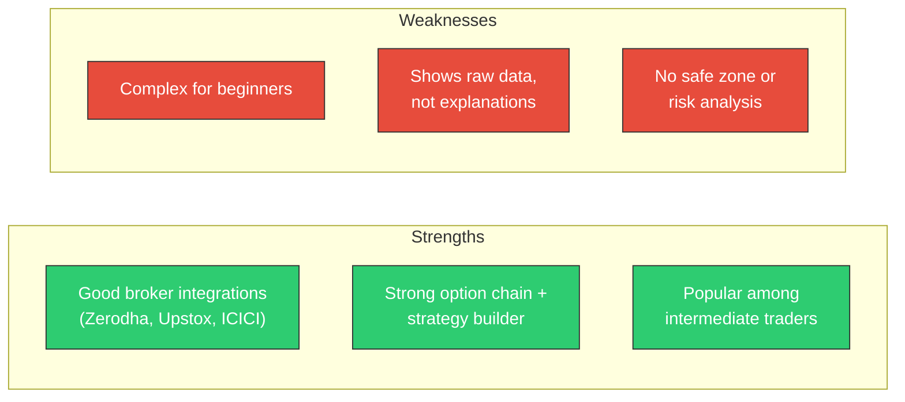

# Week 9: Comprehensive Competitor Analysis

**Date:** October 27 - November 1, 2025  
**Team:** Pooja Rani Maloth (2024204019), Jayant Anand Jha (2024204018)

---

## Objectives

- Conduct a detailed feature-by-feature comparison with direct competitors
- Analyze each competitor's strengths and weaknesses
- Map the market landscape into clear categories
- Identify specific gaps that no competitor addresses
- Define our product's strategic positioning

## Activities

- **Sensibull Analysis:** Tested the platform, reviewed pricing, analyzed feature set
- **Opstra Deep-Dive:** Explored analytics suite, reviewed user feedback online
- **Quantsapp Review:** Evaluated tool library, assessed beginner usability
- **Broker App Survey:** Checked Zerodha, Upstox, Dhan, and AngelOne for F&O features
- **Telegram/YouTube Analysis:** Surveyed popular trading channels and tip providers
- **Gap Analysis:** Identified the missing product category in the market

## Research Findings

### Feature Comparison Matrix

| Feature / Platform | Sensibull | Opstra | Quantsapp | Broker Apps | **Our Product** |
|-------------------|-----------|--------|-----------|-------------|----------------|
| Option Chain Display | Yes | Yes | Yes | Yes | Yes (Simplified) |
| OI/COI/IV/PCR Charts | Yes | Yes | Yes | Partial | Yes (Interpreted) |
| Strategy Builder | Yes | Yes | Yes | No | No (Not needed for beginners) |
| **AI Interpretation** | **No** | **No** | **No** | **No** | **Yes - Core Feature** |
| **Safe/Risk Zones** | **No** | **No** | **No** | **No** | **Yes - Proprietary** |
| **Beginner-Friendly** | **No** | **No** | **No** | **No** | **Yes** |
| Education Layer | Basic | Minimal | Moderate | Minimal | Integrated |
| Designed For | Experts | Semi-Pro | Pro Traders | All Users | **Beginners & Retail** |

### Competitor Strengths vs. Weaknesses

#### Sensibull

#### Opstra (Definedge)
- **Strengths:** Very powerful analytics suite, excellent OI/IV/Greeks tools, strong for professional traders
- **Weaknesses:** Too technical for retail users, heavy reliance on charts & Greeks, no simple insights or explanations

#### Quantsapp
- **Strengths:** Huge library of 25-70+ tools, fast OI and volume data, good for advanced traders
- **Weaknesses:** Overwhelming for beginners, needs prior F&O knowledge, no AI interpretation or simplification

#### Broker Apps (Zerodha, Upstox, Dhan, AngelOne)
- **Strengths:** Fast order execution, stable and reliable apps, basic OI and F&O insights
- **Weaknesses:** Very basic analytics only, no explanation of OI/IV/COI, no risk zone identification

### Market Landscape Categories

| Category | Examples | Their Limitation |
|----------|----------|-----------------|
| F&O Analytics Platforms | Sensibull, Opstra, Quantsapp | Data-heavy, no plain-language interpretation |
| Broker Tools | Zerodha, Upstox, Dhan | Basic OI insights only |
| Algo Platforms | Tradetron | Advanced, not built for beginners |
| Education-Only | YouTube mentors, Telegram | Non-data-backed, unreliable, risky |

### The Missing Product Category

**AI Interpretation Engine + Safe Zone Indicator for NFO Beginners**

No existing product:
- Explains *why* OI/COI is changing
- Highlights risk zones vs. safe zones
- Detects institutional intent from data patterns
- Narrates market behaviour like a mentor
- Translates technical signals into simple language
- Serves complete beginners specifically

> **This is the gap our product fills.**

### Our Strategic Position

We are **NOT** competing on:
- More charts
- More tools
- More analytics

We **ARE** competing on:
- **Clarity** -- making complex data understandable
- **Interpretation** -- explaining what data means, not just showing it
- **Risk awareness** -- helping traders avoid dangerous trades
- **Beginner-first learning** -- designed for those who know the least
- **AI summaries** instead of complex dashboards

## Insights

- Every existing tool is designed for people who already understand F&O -- nobody serves beginners
- The market has a clear "complexity gap" -- tools get more complex as they get more feature-rich
- Our product occupies a unique position: **high interpretation, low complexity**
- Competitors would need to fundamentally redesign their UX to compete with us on simplicity
- The "AI interpretation" and "safe zone" features are genuine innovations with no direct equivalent

## Challenges

- Need to validate through customer conversations that beginners actually want this (not just our assumption)
- Must ensure our interpretations are accurate enough to be trusted
- Pricing needs to undercut Sensibull (Rs 800/month) to attract beginners who are price-sensitive

## Next Week Plan

- Design the customer discovery plan: who to interview, what to ask, how to validate
- Prepare interview and survey questionnaires
- Identify target customers for interviews
- Define assumptions that need validation
