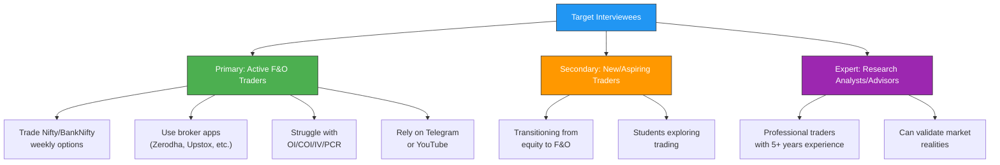
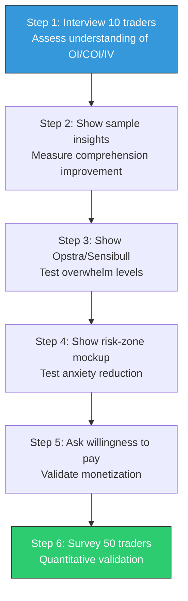

# Week 10: Customer Discovery Planning

**Date:** November 3 - November 8, 2025  
**Team:** Pooja Rani Maloth (2024204019), Jayant Anand Jha (2024204018)

---

## Objectives

- Design a comprehensive customer discovery plan
- Identify target customers for interviews and surveys
- Prepare interview and survey questionnaires
- Define all assumptions that need validation
- Create a structured test plan

## Activities

- **Target Customer Identification:** Profiled the ideal interview candidates across different trader experience levels
- **Discovery Method Selection:** Chose 4 complementary methods for customer validation
- **Questionnaire Design:** Developed 10 interview questions and 9 survey questions
- **Assumption Mapping:** Categorized assumptions into Problem, Solution, and Market assumptions
- **Test Plan Creation:** Designed a 6-step test plan for systematic validation
- **Outreach Preparation:** Identified potential interviewees from personal networks and trading communities

## Research Findings

### Target Customer Profiles

### Customer Discovery Methods

| Method | What We Do | Why |
|--------|-----------|-----|
| User Interviews | 1:1 calls with 10-20 traders | Understand confusion and mental models |
| Online Surveys | Forms distributed in trading groups | Identify patterns and needs at scale |
| Landing Page Test | Show product concept page | Measure signups and interest |
| Prototype Testing | Show explanation samples | Validate usefulness and clarity |

**Primary Goal:** Validate whether users genuinely struggle with interpretation and want plain-language insights.

### Assumptions to Validate

#### A. Problem Assumptions
- Traders struggle to interpret OI/COI/IV data
- Many traders rely on influencer tips instead of data
- Losses happen primarily due to lack of interpretation
- Existing dashboards overwhelm beginners
- Users prefer simple explanations over raw charts

#### B. Solution Assumptions
- AI-generated insights will actually help traders make better decisions
- A risk-zone model will reduce trading anxiety
- Transparency in reasoning increases user trust
- Minimal UI is preferred over feature-rich dashboards
- Users will pay for a tool that helps them avoid losses

#### C. Market Assumptions
- Large enough beginner F&O segment exists
- Existing tools genuinely ignore beginners
- Mobile-first is the preferred format
- Traders are open to trying new platforms
- Demand exists for interpretation over raw indicators

### Interview Questionnaire (10 Questions)

1. How long have you been trading F&O?
2. What tools do you currently use for trading?
3. Can you explain what OI or COI means in your own words?
4. Have you ever taken a trade based on OI change? Why?
5. Where do you usually get your trade ideas?
6. What causes most of your losses?
7. Do you feel overwhelmed by market data?
8. Would plain-language insights help your confidence?
9. What features would make you trust an AI trading assistant?
10. Would you pay for a tool that prevents unnecessary losses?

### Survey Questionnaire (9 Questions)

1. How often do you trade weekly options?
2. Do you understand OI, COI, IV, PCR? (Yes/No/Somewhat)
3. What influences your trades most? (Tips/Data/Charts/News)
4. Have you previously lost money due to misunderstanding OI/COI?
5. Would plain-language insights be useful?
6. Do dashboards overwhelm you?
7. Would you like risk zones identified clearly?
8. Would you try an AI-based interpretation tool?
9. What is your willingness to pay monthly?

### Test Plan

### Interviewees Identified

We identified 3 interviewees from our personal network, representing different trader profiles:

| Name | Profile | Trading Experience | Why Selected |
|------|---------|-------------------|-------------|
| Uma | Retail trader, family of investors | ~3 years in F&O | Uses Moneycontrol + instinct, doesn't follow OI/COI |
| Lakhu Bhai | Young trader, Nifty-focused | ~2-3 years | Uses Sensibull, found it not user-friendly initially |
| Saurabh Shukla | Research analyst, professional | 5+ years | Industry expert, can validate market assumptions |

## Insights

- Having 3 different trader profiles (beginner, intermediate, expert) gives us a well-rounded view
- The interview questions are designed to be open-ended -- we want to discover unknowns, not confirm biases
- The test plan follows a progressive validation approach: understand -> show -> test -> validate willingness to pay
- Combining qualitative (interviews) with quantitative (surveys) methods strengthens our findings

## Challenges

- Limited time to conduct all interviews and surveys within the project timeline
- Need to ensure we don't lead interviewees toward our desired answers
- Survey distribution in trading communities may have self-selection bias

## Next Week Plan

- Conduct all 3 customer interviews (Uma, Lakhu Bhai, Saurabh Shukla)
- Record calls and create transcripts for documentation
- Take detailed notes on pain points, behaviours, and unexpected insights
