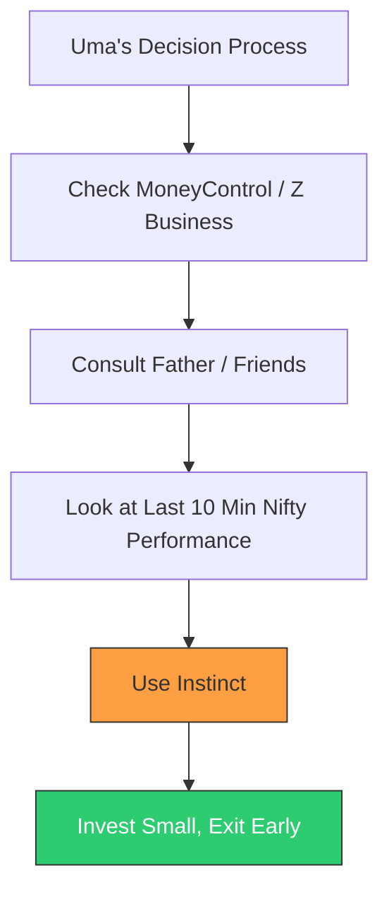
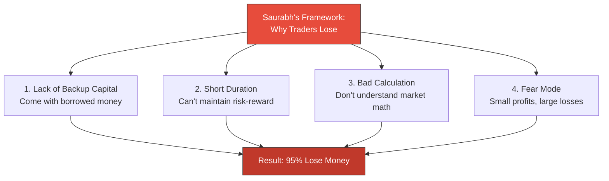

# Week 11: Customer Interviews - Field Research

**Date:** November 10 - November 15, 2025  
**Team:** Pooja Rani Maloth (2024204019), Jayant Anand Jha (2024204018)

---

## Objectives

- Conduct 3 in-depth customer interviews with traders of varying experience levels
- Record calls and create transcripts for documentation
- Capture raw insights, pain points, and behavioral patterns
- Identify unexpected findings that challenge or confirm our assumptions

## Activities

- **Interview 1 - Uma:** Retail F&O trader with 3 years of experience. Conducted by Pooja with Jayant observing.
- **Interview 2 - Lakhu Bhai:** Young Nifty trader with 2-3 years of experience. Conducted in Hindi. Jayant led the conversation.
- **Interview 3 - Saurabh Shukla:** Professional research analyst with 5+ years of experience. Conducted by Pooja.
- **Transcription:** All calls were recorded and transcribed for documentation
- **Note-Taking:** Detailed notes taken during each interview on key quotes and behavioral observations

## Research Findings

### Interview 1: Uma (Retail Trader, 3 Years Experience)

**Profile:** Family background in investing (father is a long-term investor in Tata, Adani, Vedanta). Uses MoneyControl and Z Business channel. Invests 10% of monthly income / 20% of total investments in F&O.

**Key Quotes:**
> "FNO is completely about the risk factor. I completely take my decision based on the last 10 minutes Nifty performance or my instinct."

> "There is no terms that I follow in FNO because it's a short money that you get."

> "If somebody is giving me that tool only for even just paper trading, I will be very curious to try that."

> "If I have the guarantee that it will give me the 90 to 95% correct predictions, I will definitely pay for it."

**Behavioral Insights:**
- Does NOT use OI/COI/IV parameters at all -- trades on instinct and Nifty performance
- Relies on father, co-workers, and broker advisors for guidance
- Biggest risk factor according to her: **greediness** -- people don't set stop points
- Lost a significant amount once (profit of Rs 50,000 on Rs 15,000 investment) due to connection loss during an exam
- Strategy: invest 10,000, make 1,500 profit, exit. No greed.
- Was overwhelmed by market data initially; Jayant taught her F&O

### Interview 2: Lakhu Bhai (Young Trader, 2-3 Years Experience)

**Profile:** Started trading during college. Invests 5% of total investment allocation in NFO (25-30% goes to all instruments combined). Nifty-focused, intraday only.

**Key Quotes (translated from Hindi):**
> "NFO is not safe compared to other instruments... because the contract doesn't give you ownership"

> "First time user ke liye [Sensibull] bilkul bhi nahi hai... I had to watch many YouTube videos to learn how to read it"

> "Major reason [for losses] is lack of knowledge, and blindly trusting Telegram tips"

**Behavioral Insights:**
- Only 5% in NFO because he considers it high-risk (no ownership, just contracts)
- Uses Sensibull but found it very difficult initially -- had to learn from YouTube videos
- Struggled with OI, COI, IV when starting out
- Trades Nifty only (considers it safer than BankNifty)
- Strictly intraday -- doesn't hold overnight due to additional costs
- Follows 2-3 YouTube channels for learning (CA Rachana Ladda, Senology)
- Would try a tool with plain-language insights and paper trading: "Try karke to lena chahega"

### Interview 3: Saurabh Shukla (Research Analyst, 5+ Years)

**Profile:** Professional research analyst. Entire work for last 5 years has been on F&O. Expert-level understanding of the market.

**Key Quotes:**
> "Out of 100, 87 to 90% people are into the FNO only. They are not doing real kind of investments."

> "SEBI says out of [these], 95% people lose money."

> "They come for quick gains to meet out the expense, close the expense and then come back again next day."

> "These people haven't studied the math in the primary classes... they don't understand what kind of mathematics we should be doing."

> "Without studying, without understanding the skill, you cannot become investor or trader."

**Expert Insights:**
- 87-90% of Indian investors are in F&O (speculators), only 7-8% are real investors
- Top reasons for losses:
  1. Lack of backup capital
  2. Short investment duration
  3. Poor risk-reward calculation
  4. Fear mode: small profits, large losses
- People come to the market to solve immediate expenses (EMIs, personal needs)
- They don't know "the market capacity to give" -- unrealistic expectations
- The cricket analogy: "You must know the speed of your bat, velocity of the ball, the air movement... nobody knowing anything and coming to the market"
- Emphasized the importance of enjoying money (removing fear) before investing

## Cross-Interview Comparison

| Dimension | Uma (Beginner) | Lakhu Bhai (Intermediate) | Saurabh (Expert) |
|-----------|----------------|--------------------------|-------------------|
| Experience | 3 years | 2-3 years | 5+ years |
| Uses OI/COI? | No | Learned over time | Yes, professionally |
| Decision Process | Instinct + tips | Sensibull + YouTube | Professional analysis |
| Overwhelmed by data? | Yes, initially | Yes, initially with Sensibull | No (expert) |
| Top loss reason | Greediness | Lack of knowledge, Telegram | Poor risk-reward, fear |
| Would use AI tool? | Yes, if 90-95% accurate | Yes, would try | Implied yes (sees the need) |
| Would pay? | Yes, with accuracy guarantee | Yes, after paper trading trial | N/A (professional) |

## Insights

- **All three confirmed the interpretation gap** -- even Uma (3 years experience) doesn't use OI/COI at all
- **Sensibull's complexity is validated** -- Lakhu Bhai explicitly said it's not user-friendly for beginners
- **Paper trading is a strong trust-building mechanism** -- both Uma and Lakhu Bhai mentioned it
- **Greediness + lack of knowledge** are the two dominant reasons for losses across all interviews
- **Telegram/YouTube dependency is real** -- both Uma and Lakhu Bhai mentioned these as information sources
- **The expert (Saurabh) validates the systemic problem** -- 87-90% are speculators, 95% lose money
- **Willingness to pay exists** but is conditional on accuracy and trust (paper trading as proof)

## Challenges

- Interview sample size is small (3 interviews) -- need surveys for quantitative validation
- Hindi transcripts from Lakhu Bhai interview need careful translation for report
- Some interviewees conflated "predictions" with "interpretation" -- need to clarify our positioning

## Next Week Plan

- Analyze all interview data systematically
- Map findings to our assumptions (validate/invalidate)
- Synthesize key insights into actionable product decisions
- Draft next steps for the product based on validated learnings
