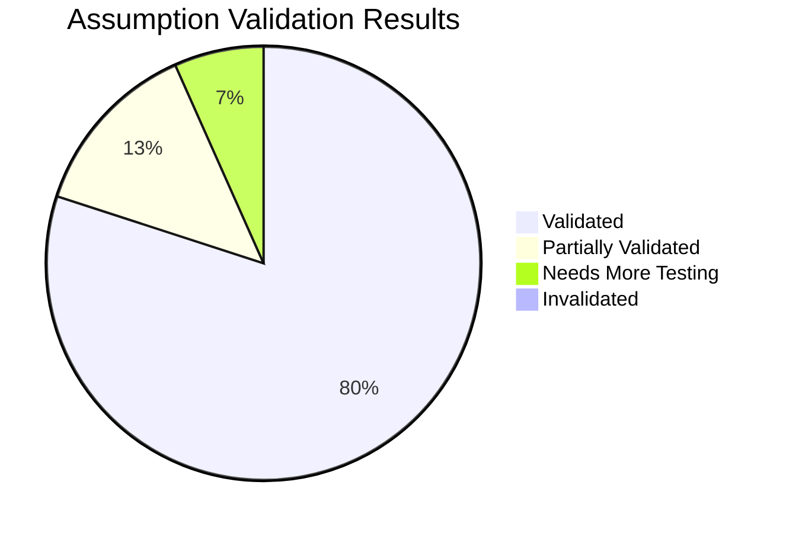
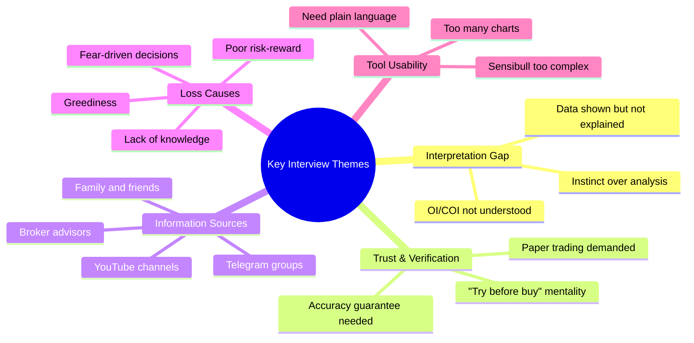
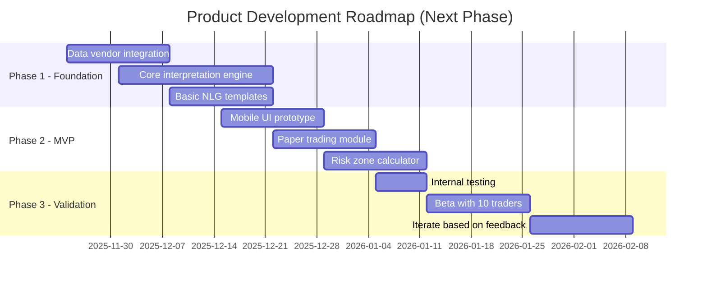
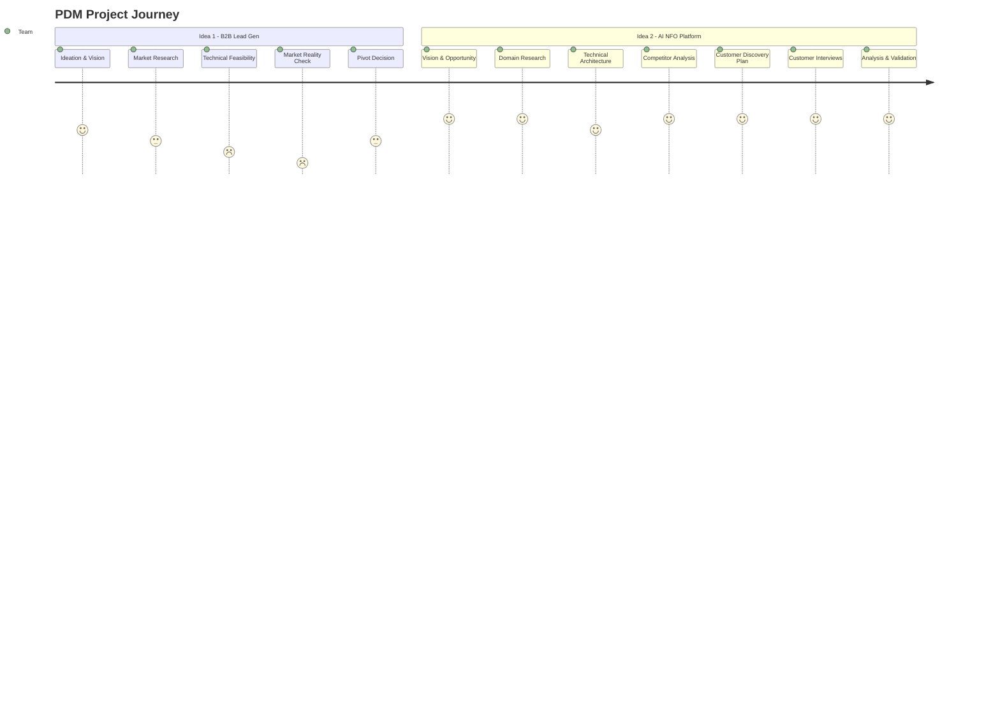

# Week 12: Interview Analysis, Assumption Validation & Next Steps

**Date:** November 17 - November 22, 2025  
**Team:** Pooja Rani Maloth (2024204019), Jayant Anand Jha (2024204018)

---

## Objectives

- Systematically analyze all interview data from Week 11
- Map findings against our documented assumptions
- Synthesize validated insights into product decisions
- Define concrete next steps for the product development phase

## Activities

- **Transcript Analysis:** Re-read all three interview transcripts and highlighted key themes
- **Assumption Mapping:** Matched interview findings to each assumption category
- **Insight Synthesis:** Identified common patterns across all three interviews
- **Product Implication Analysis:** Translated validated findings into product feature priorities
- **Next Phase Planning:** Outlined the product development roadmap for upcoming weeks

## Research Findings

### Assumption Validation Results

#### Problem Assumptions

| Assumption | Status | Evidence |
|-----------|--------|----------|
| Traders struggle to interpret OI/COI/IV | **VALIDATED** | Uma doesn't use OI/COI at all. Lakhu Bhai struggled initially with Sensibull data. |
| Many rely on influencer tips | **VALIDATED** | Uma follows friends/advisors. Lakhu Bhai mentions Telegram pump-and-dump schemes. |
| Losses happen due to lack of interpretation | **VALIDATED** | Saurabh confirms 95% lose due to not understanding market math. Lakhu Bhai cites "lack of knowledge." |
| Dashboards overwhelm beginners | **VALIDATED** | Lakhu Bhai: Sensibull "bilkul bhi nahi hai" (not at all) user-friendly for first-timers. |
| Users prefer simple explanations | **VALIDATED** | Uma would pay for 90-95% accurate predictions. Lakhu Bhai wanted plain-language insights. |

#### Solution Assumptions

| Assumption | Status | Evidence |
|-----------|--------|----------|
| AI-generated insights will help | **PARTIALLY VALIDATED** | All interviewees showed interest, but "accuracy guarantee" is critical for trust. |
| Risk-zone model reduces anxiety | **NEEDS MORE TESTING** | Not directly tested in interviews; needs prototype testing. |
| Transparency increases trust | **VALIDATED** | Uma and Lakhu Bhai both want to verify accuracy through paper trading before committing. |
| Minimal UI is preferred | **VALIDATED** | Lakhu Bhai's Sensibull experience confirms complex UIs deter beginners. |
| Users will pay to avoid losses | **VALIDATED** | Uma: "If I have the guarantee... I will definitely pay." Lakhu Bhai: "Try karke to lena chahega." |

#### Market Assumptions

| Assumption | Status | Evidence |
|-----------|--------|----------|
| Large beginner F&O segment | **VALIDATED** | Saurabh: 87-90% of Indian investors are in F&O, mostly speculators. |
| Existing tools ignore beginners | **VALIDATED** | All competitors target intermediate-to-expert traders. No beginner-focused tool exists. |
| Mobile-first preference | **VALIDATED** | All interviewees use mobile apps for trading. |
| Openness to new platforms | **VALIDATED** | All three expressed interest in trying a new tool with the right features. |
| Demand for interpretation | **VALIDATED** | Core finding -- interpretation is the fundamental gap across all experience levels. |

### Validation Summary

**12 out of 15 assumptions were validated. 2 partially validated. 1 needs prototype testing. None were invalidated.**

### Key Insight Themes Across All Interviews

### Product Feature Prioritization (Based on Validated Findings)

| Priority | Feature | Validation Source |
|----------|---------|-----------------|
| P0 (Must Have) | Plain-language interpretation of OI/COI/IV | All 3 interviews |
| P0 (Must Have) | Mobile-first clean interface | All interviewees are mobile traders |
| P0 (Must Have) | Paper trading for trust-building | Uma & Lakhu Bhai explicitly requested |
| P1 (High) | Risk/Safe zone highlighting | Validated through loss pattern analysis |
| P1 (High) | "Why is market moving" explanations | Uma trades on instinct because she can't interpret data |
| P2 (Medium) | Push notifications for critical signals | Implied by intraday trading patterns |
| P2 (Medium) | Educational micro-content | Lakhu Bhai learned from YouTube -- integrated learning is better |
| P3 (Nice to Have) | Historical accuracy dashboard | Uma wants accuracy guarantees |

### Revised Product Positioning

Based on customer discovery, our positioning should emphasize:

1. **"Your AI Trading Mentor"** -- not just a tool, but a mentor that explains things simply
2. **"See Before You Risk"** -- paper trading as a trust mechanism
3. **"No Jargon, Just Clarity"** -- differentiates from every competitor
4. **"Built for Beginners"** -- explicitly own the beginner segment that nobody else serves

### Next Phase: Product Development Roadmap

## Insights

- **The problem is even more severe than we assumed** -- traders like Uma with 3 years of experience still don't use OI/COI at all. The interpretation gap isn't just for beginners; it persists even for experienced retail traders.
- **Paper trading is the critical trust mechanism** -- without it, convincing users to pay will be significantly harder. This should be a P0 feature, not a nice-to-have.
- **The "greediness" insight is actionable** -- our product can include behavioral nudges (e.g., "You've reached your target. Consider exiting.") to help traders manage emotions.
- **Saurabh's expert perspective validates the systemic nature of the problem** -- this isn't just a niche issue; it affects 87-90% of market participants.
- **Competitive moat is real** -- no competitor is moving toward beginner-friendly AI interpretation. This gives us time to build and establish the category.

## Challenges

- Need to move from validated assumptions to actual product development
- Data vendor contracts need to be finalized
- NLG quality will be the make-or-break factor for user trust
- SEBI compliance for paper trading still needs legal review

## Summary: Weeks 1-12 Journey

## Looking Ahead

The first 12 weeks established a solid foundation:
- A well-validated problem space with quantitative evidence (SEBI data) and qualitative evidence (3 customer interviews)
- Clear product vision and differentiation strategy
- Technical architecture designed and feasible within constraints
- Customer willingness to pay confirmed (with paper trading as the trust mechanism)

The next phase focuses on **building the MVP** -- starting with data integration, the core interpretation engine, and a mobile-first prototype for beta testing with real traders.

---

*End of Weekly Progress Reports - Weeks 1 through 12*
