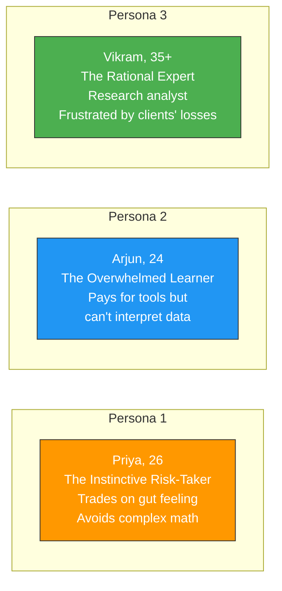
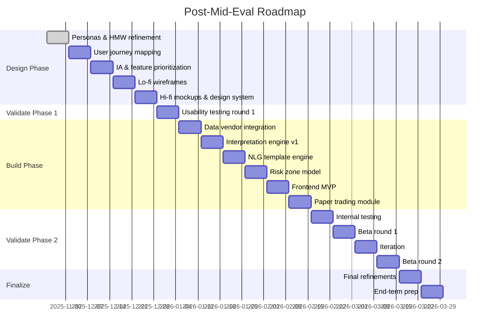

# Week 13: Post-Mid-Eval Retrospective & Personas Finalization

**Date:** November 24 - November 29, 2025  
**Team:** Pooja Rani Maloth (2024204019), Jayant Anand Jha (2024204018)

---

## Objectives

- Reflect on mid-term evaluation feedback from professor
- Finalize the three user personas based on all 8 interviews conducted
- Refine the HMW (How Might We) statement for the design phase
- Plan the post-mid-eval roadmap for the Design & Build phase

## Activities

- **Mid-Eval Retrospective:** Reviewed professor's feedback on the Plan & Define phase presentation. Key feedback: strong problem validation, need to move quickly into design and prototyping.
- **Persona Finalization:** Consolidated interview data from all 8 traders into 3 distinct personas with detailed profiles including Jobs To Be Done, Pains, Gains, Influencers, and Use Cases.
- **HMW Refinement:** Sharpened the HMW statement to focus on the specific "interpretation gap" moment.
- **Roadmap Planning:** Created a week-by-week plan for the Design, Build, and Validate phases.

## Research Findings

### Finalized Personas

#### Persona 1: Priya, The Instinctive Risk-Taker
- **Age:** 26, family background in business
- **JTBD:** Needs a way to validate her gut instincts quickly without complex calculations
- **Pains:** Math anxiety, uncertainty about whether her instinct is correct, no way to back-test strategies
- **Gains:** A "second opinion" tool, plain English warnings, paper trading to test accuracy
- **Use Cases:** Quick check before trade, risk zone identification, weekend paper trading practice

#### Persona 2: Arjun, The Overwhelmed Learner
- **Age:** 24, Engineering graduate
- **JTBD:** Needs an "interpretation layer" that translates raw data into clear Buy/Sell/Hold narratives
- **Pains:** Context blindness (sees "OI 24 Lakhs" but doesn't know if bullish/bearish), tool fatigue, loss of confidence
- **Gains:** Clarity on market direction, education through the app's narratives, stop relying on Telegram
- **Use Cases:** Pre-trade market summary, live decision-making during crashes, post-trade review

#### Persona 3: Vikram, The Rational Expert
- **Age:** 35+, Research Analyst with 5+ years
- **JTBD:** Needs to educate clients or validate his own complex analysis quickly
- **Pains:** Client irrationality, "math gap" among retail traders, emotional trading destroying risk-reward
- **Gains:** Automated narrative output for clients, probability-of-profit display, training tool for juniors
- **Use Cases:** Client communication, sanity checks, training new analysts via paper trading

### Refined HMW Statement

> **How Might We** intervene in the "Interpretation Gap" -- the specific moment a user stares at an Option Chain but cannot decode the risk -- by replacing manual calculation with automated narrative insights, thus preventing the switch to unreliable Tip channels?

### Post-Mid-Eval Roadmap

## Insights

- The mid-eval feedback confirmed our problem validation is strong -- the professor specifically noted the SEBI data and interview methodology as highlights
- The "math anxiety" insight from the mid-eval presentation resonated -- 7 out of 8 users ignore risk metrics because they cannot calculate them live
- The key framing: **"This is a design failure, not a user failure"** -- the market has solved Access but not Understanding
- Personas help us make design decisions: every feature must serve at least one persona's JTBD

## Challenges

- 18 weeks is a tight timeline for design + build + validate
- Need to scope the MVP carefully -- can't build everything
- Professor expects to see a working prototype by end-eval, not just designs

## Next Week Plan

- Map user journeys for all three personas
- Identify the critical "moments of truth" in the trading workflow
- Begin sketching the core interaction flow
