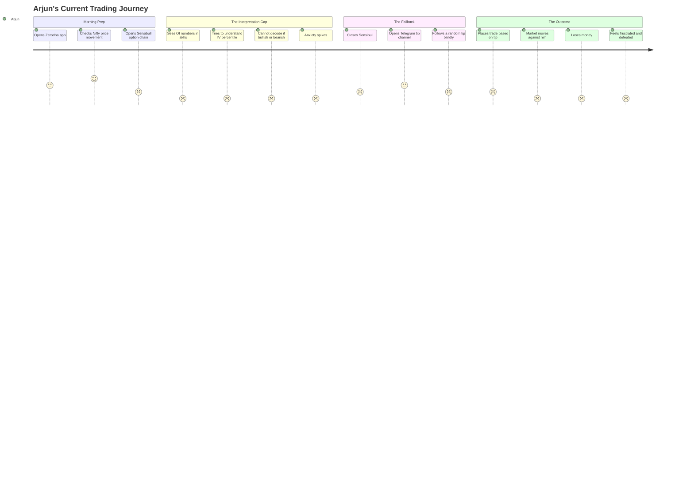
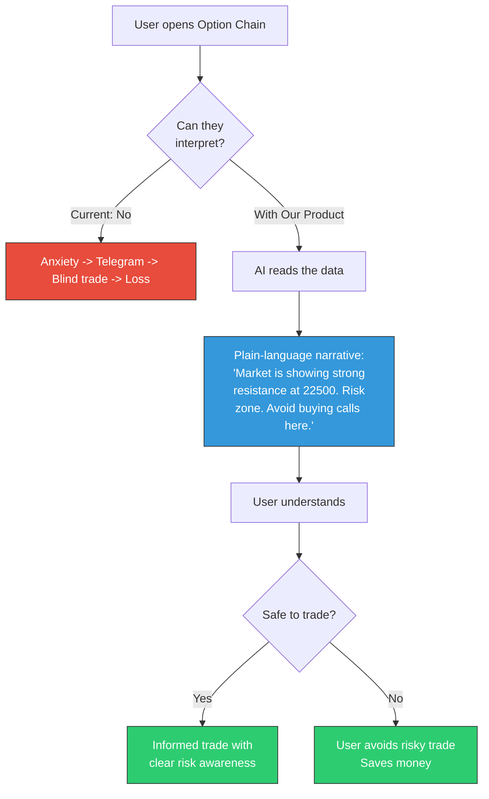

# Week 14: User Journey Mapping & Pain Point Analysis

**Date:** December 1 - December 6, 2025  
**Team:** Pooja Rani Maloth (2024204019), Jayant Anand Jha (2024204018)

---

## Objectives

- Map end-to-end user journeys for all three personas
- Identify critical pain points and "moments of truth" in the trading workflow
- Define where our product intervenes in the current broken process
- Create an empathy map for the primary persona (Arjun)

## Activities

- **Journey Mapping Workshop:** Both team members walked through a typical trading day for each persona
- **Pain Point Cataloguing:** Identified and ranked pain points by severity and frequency
- **Intervention Point Analysis:** Mapped exactly where our product fits in the user's workflow
- **Empathy Map Creation:** Built a detailed empathy map for Arjun (primary persona)

## Research Findings

### The Current Broken Journey (Arjun's Perspective)

### Our Product Intervention Point

### Pain Point Severity Matrix

| Pain Point | Persona(s) | Severity | Frequency | Our Solution |
|-----------|-----------|----------|-----------|-------------|
| Cannot interpret OI/COI numbers | Arjun, Priya | Critical | Every trade | AI narrative engine |
| Doesn't know if strike is safe/risky | Arjun, Priya | Critical | Every trade | Risk zone model |
| Overwhelmed by dashboard complexity | Arjun | High | Daily | Minimal UI with 2-3 key insights |
| Relies on Telegram tips | Priya, Arjun | High | Weekly | Replace tips with data-backed insights |
| Cannot explain market logic to clients | Vikram | Medium | Daily | Narrative output for client communication |
| No way to practice without real money | Priya, Arjun | Medium | Ongoing | Paper trading module |
| Post-trade confusion ("Why did I lose?") | Arjun | Medium | After losses | Post-trade analysis with explanation |

### Empathy Map: Arjun (Primary Persona)

| Dimension | Details |
|-----------|---------|
| **Thinks** | "I'm paying for Sensibull but I still don't understand what the numbers mean" |
| **Feels** | Anxious before trades, frustrated after losses, envious of "successful" traders on YouTube |
| **Says** | "The data is all there, I just can't make sense of it" |
| **Does** | Opens Sensibull, stares at it for 5 min, closes it, opens Telegram, follows a tip |
| **Hears** | YouTube influencers saying "Just follow OI data!", friends bragging about profits |
| **Sees** | Complex charts, numbers in lakhs, IV percentiles, Greek symbols |

## Insights

- The "interpretation gap" happens in a very specific 2-3 minute window: between opening the option chain and placing a trade. This is our intervention point.
- The emotional arc is: **Curiosity -> Confusion -> Anxiety -> Surrender (to tips) -> Regret**. Our product must break this cycle at the Confusion stage.
- Vikram's journey is different -- he understands the data but wants the narrative output to communicate with clients. This is a secondary but important use case.
- The "post-trade review" use case was unexpected -- several interviewees wanted to understand *why* they lost, not just *that* they lost.

## Challenges

- Need to ensure the AI narratives are available fast enough to be useful in the 2-3 minute decision window
- Journey mapping revealed that Priya and Arjun have very different emotional needs despite similar functional needs

## Next Week Plan

- Define information architecture for the app
- Prioritize features using MoSCoW framework
- Begin sketching core screen layouts
