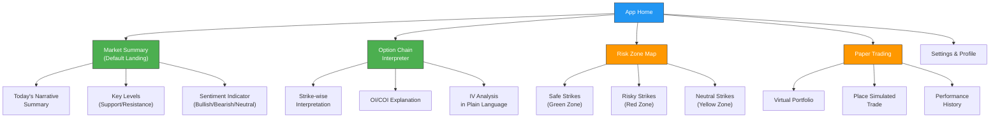
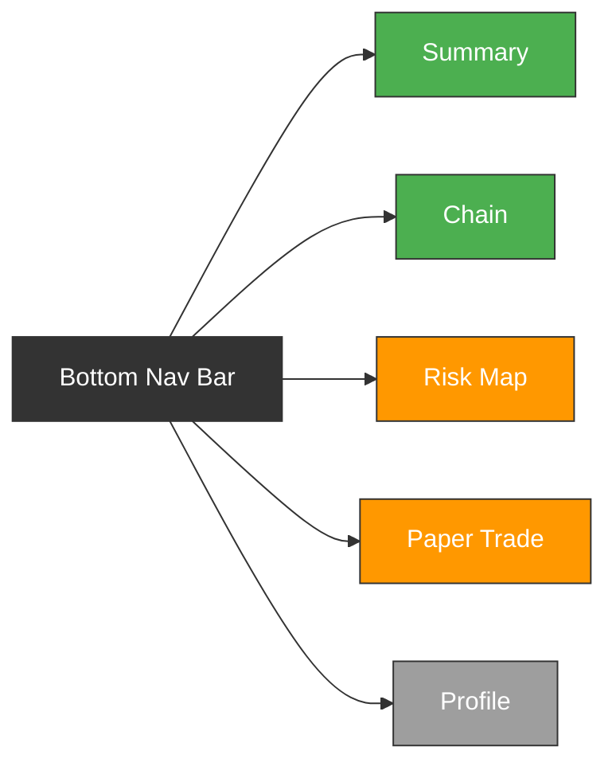

# Week 15: Information Architecture & Feature Prioritization

**Date:** December 8 - December 13, 2025  
**Team:** Pooja Rani Maloth (2024204019), Jayant Anand Jha (2024204018)

---

## Objectives

- Define the information architecture (IA) for the mobile app
- Prioritize features using the MoSCoW framework
- Map feature priorities to persona needs
- Create the core navigation structure and screen inventory

## Activities

- **IA Design:** Defined the app's structure with primary, secondary, and tertiary levels
- **MoSCoW Prioritization:** Categorized all features into Must-have, Should-have, Could-have, Won't-have
- **Screen Inventory:** Listed all screens needed for the MVP
- **Navigation Flow Design:** Created the primary navigation structure

## Research Findings

### Information Architecture

### MoSCoW Feature Prioritization

| Priority | Feature | Persona | Rationale |
|----------|---------|---------|-----------|
| **Must Have** | Market Summary with AI narrative | All | Core value prop -- first thing user sees |
| **Must Have** | Strike-wise OI/COI interpretation | Arjun, Priya | Solves the primary interpretation gap |
| **Must Have** | Risk zone highlighting (Safe/Risky) | All | Key differentiator, prevents losses |
| **Must Have** | Beginner-friendly minimal UI | Arjun, Priya | Cannot overwhelm -- this is the whole point |
| **Should Have** | Paper trading simulator | Priya, Arjun | Trust-building mechanism validated in interviews |
| **Should Have** | IV explanation in plain language | Arjun | Second most confusing metric after OI |
| **Should Have** | Push notifications for critical signals | All | Intraday traders need timely alerts |
| **Could Have** | Post-trade analysis ("Why did I lose?") | Arjun | Valuable but can be added in v2 |
| **Could Have** | Client narrative export | Vikram | Secondary persona use case |
| **Could Have** | Historical accuracy dashboard | Priya | Trust metric -- "how accurate was the AI?" |
| **Won't Have (v1)** | Strategy builder | -- | Expert feature, not for beginners |
| **Won't Have (v1)** | Auto-trading / execution | -- | Regulatory complexity, out of scope |
| **Won't Have (v1)** | Multi-index support (beyond Nifty) | -- | Start with Nifty only for MVP |

### Core Screen Inventory (MVP)

| Screen | Purpose | Priority |
|--------|---------|----------|
| Splash / Onboarding | First-time user introduction | Must |
| Market Summary | Landing page with today's AI narrative | Must |
| Option Chain View | Simplified chain with per-strike explanations | Must |
| Strike Detail | Deep-dive into a specific strike with AI reasoning | Must |
| Risk Zone Map | Visual map of safe/neutral/risky strikes | Must |
| Paper Trade Entry | Place a simulated trade | Should |
| Paper Trade Portfolio | View virtual P&L | Should |
| Settings | Preferences, notifications, account | Must |

### Navigation Structure

## Insights

- The IA is intentionally flat -- maximum 2 taps to reach any screen. Depth creates confusion.
- Market Summary as the default landing page means users get value the moment they open the app, without navigating anywhere
- Paper trading is "Should Have" not "Must Have" for MVP -- interpretation is the core, paper trading is the trust layer
- Limiting to Nifty-only for v1 dramatically reduces complexity while serving the largest user segment

## Challenges

- Balancing simplicity with enough depth for intermediate traders (Arjun wants detail, Priya wants simplicity)
- Risk zone model logic needs to be defined before wireframing -- what exactly makes a strike "risky"?

## Next Week Plan

- Create low-fidelity wireframes for all Must Have screens
- Define the visual hierarchy for the Market Summary screen
- Sketch the option chain interpretation layout
