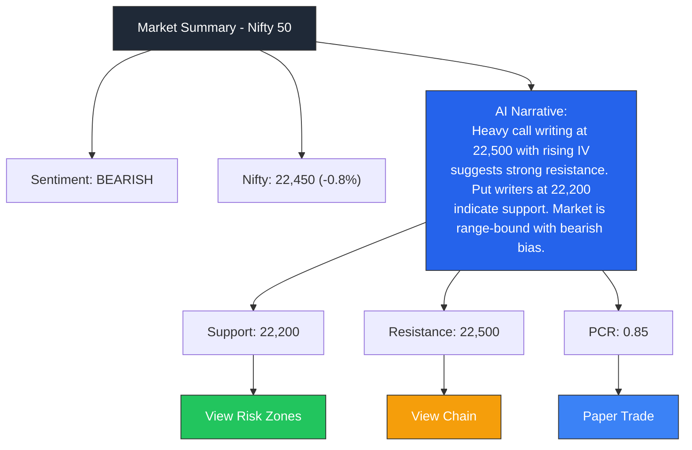
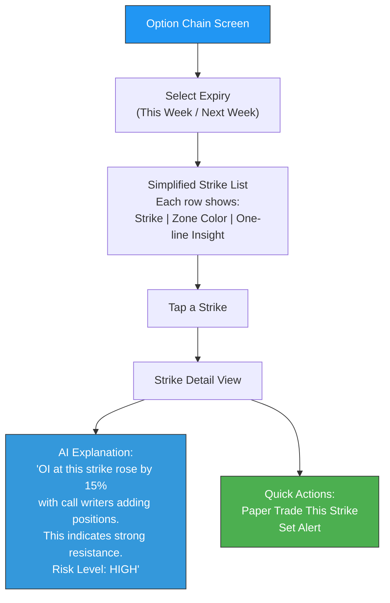

# Week 16: Low-Fidelity Wireframes

**Date:** December 15 - December 20, 2025  
**Team:** Pooja Rani Maloth (2024204019), Jayant Anand Jha (2024204018)

---

## Objectives

- Create low-fidelity wireframes for all Must Have screens
- Define the visual hierarchy and information layout
- Ensure wireframes align with persona needs and the IA from Week 15
- Get initial peer feedback on wireframe usability

## Activities

- **Wireframe Sketching:** Created paper sketches for all 8 core screens
- **Digital Wireframes:** Converted sketches to digital low-fi wireframes using Figma
- **Peer Review:** Shared wireframes with 2 classmates for quick feedback
- **Iteration:** Refined wireframes based on peer feedback

## Research Findings

### Market Summary Screen (Landing Page) - Layout

### Key Wireframe Design Decisions

| Decision | Rationale | Persona Served |
|----------|-----------|---------------|
| AI narrative is the hero element | Users want plain English first, numbers second | Arjun, Priya |
| Traffic-light color coding (Green/Yellow/Red) | Instant visual risk assessment without reading | All |
| Maximum 3 key metrics on summary | Noise reduction -- only show what matters | Priya |
| "Why?" expandable on every insight | Curious users can learn more; casual users skip | Arjun |
| Large touch targets for mobile | Intraday traders tap quickly during market hours | All |
| No charts on landing page | Charts overwhelm beginners -- available on demand | Arjun, Priya |

### Option Chain Interpreter - Wireframe Flow

### Risk Zone Map - Visual Concept

The risk zone map displays strikes as a vertical spectrum:

| Zone | Color | Meaning | Example |
|------|-------|---------|---------|
| Safe Zone | Green | Low risk, stable OI, low IV | Strikes far from current price with high writer confidence |
| Caution Zone | Yellow | Moderate risk, changing OI | Strikes near support/resistance with mixed signals |
| Danger Zone | Red | High risk, high IV, unstable OI | Strikes where institutional activity suggests traps |

### Peer Feedback Summary

- "The AI narrative is really clear -- I'd use this even as someone who knows OI"
- "Add a timestamp to the narrative so users know how fresh the data is"
- "The paper trade button on strike detail is smart -- reduces friction"
- "Consider adding a 'confidence score' to each narrative"

## Insights

- The wireframes validated our core design principle: **narrative first, data second**
- Traffic-light color coding for risk zones tested extremely well -- instant comprehension without reading
- The expandable "Why?" pattern lets us serve both Priya (just wants the answer) and Arjun (wants to learn)
- Peer feedback about timestamps is critical -- stale data in trading is dangerous

## Challenges

- Defining exactly what logic determines Safe/Caution/Danger zones requires domain-specific rules
- Balancing information density for the option chain view -- too sparse feels useless, too dense overwhelms

## Next Week Plan

- Create high-fidelity mockups with actual visual design
- Define the color palette, typography, and design system
- Design the dark mode variant (traders prefer dark screens)
