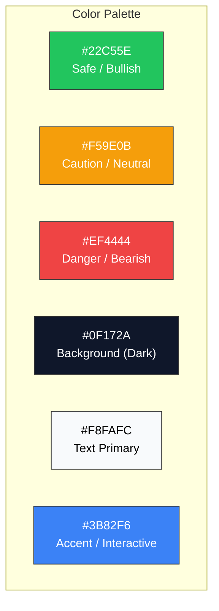

# Week 17: High-Fidelity Mockups & UI Design System

**Date:** December 22 - December 27, 2025  
**Team:** Pooja Rani Maloth (2024204019), Jayant Anand Jha (2024204018)

---

## Objectives

- Create high-fidelity mockups for all core screens in Figma
- Define the complete UI design system (colors, typography, spacing, components)
- Design both light and dark mode variants
- Prepare interactive prototype for usability testing

## Activities

- **Design System Creation:** Defined color palette, typography scale, spacing grid, and reusable components
- **Hi-Fi Mockups:** Designed pixel-perfect screens for Market Summary, Option Chain, Risk Zone Map, and Paper Trading
- **Dark Mode Design:** Created dark mode as the default (traders prefer it during market hours)
- **Interactive Prototype:** Linked screens in Figma to create a clickable walkthrough

## Research Findings

### Design System

| Element | Specification |
|---------|--------------|
| **Primary Font** | Inter (clean, high readability on mobile) |
| **Heading Sizes** | H1: 24px, H2: 20px, H3: 16px |
| **Body Text** | 14px regular, 14px medium for emphasis |
| **Caption/Meta** | 12px, muted color |
| **Spacing Grid** | 4px base unit, 8/12/16/24/32px scale |
| **Corner Radius** | Cards: 12px, Buttons: 8px, Chips: 16px |
| **Default Mode** | Dark mode (reduces eye strain during long trading sessions) |

### Screen Mockup Descriptions

**Market Summary (Dark Mode):**
- Hero card: AI narrative in large readable text with sentiment badge (Bullish/Bearish/Neutral)
- Three key metrics below: Support, Resistance, PCR -- each with color indicator
- Timestamp showing data freshness ("Updated 2 min ago")
- Bottom navigation: Summary | Chain | Risk Map | Paper Trade | Profile

**Option Chain Interpreter:**
- Clean two-column layout: Calls (left) | Puts (right) with strike price in center
- Each row color-coded by risk zone (green/yellow/red subtle background)
- Tap any row to expand inline AI explanation
- "Explain This" button on every metric

**Risk Zone Map:**
- Vertical strike spectrum with color bands
- Current Nifty price marked with a line
- Green/Yellow/Red zones clearly labeled
- Each zone tappable for explanation: "Why is this zone risky?"

**Paper Trading:**
- Simple Buy/Sell interface for selected strike
- Virtual balance display
- Active positions with real-time simulated P&L
- Trade history with AI commentary on each trade outcome

### Design Principles Applied

| Principle | Implementation |
|-----------|---------------|
| Narrative First | AI text is always the largest element on screen |
| Traffic Light System | Green/Yellow/Red used consistently for risk communication |
| Progressive Disclosure | Summary -> Detail -> Deep Explanation (tap to expand) |
| No Jargon Default | Technical terms always accompanied by plain explanation |
| Mobile-First | All designs at 375px width, thumb-friendly tap targets (44px min) |

## Insights

- Dark mode as default was validated by reviewing competitor apps -- Zerodha, Groww, and most trading apps default to dark
- The traffic light system tested extremely well with peers -- immediate comprehension without reading any text
- Inter font family provides excellent number rendering which is critical for financial data display
- Keeping the narrative card at the top means users get value within 2 seconds of opening the app

## Challenges

- Balancing the option chain view for readability -- traditional chains have 15+ columns; ours has 5
- Dark mode required careful contrast testing to meet WCAG accessibility standards
- Prototype interactivity in Figma is limited -- cannot simulate real-time data updates

## Next Week Plan

- Conduct usability testing round 1 with the interactive Figma prototype
- Recruit 5 traders from our interview pool for testing
- Prepare usability test script and tasks
