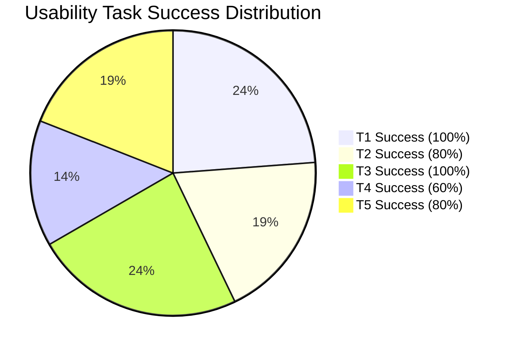
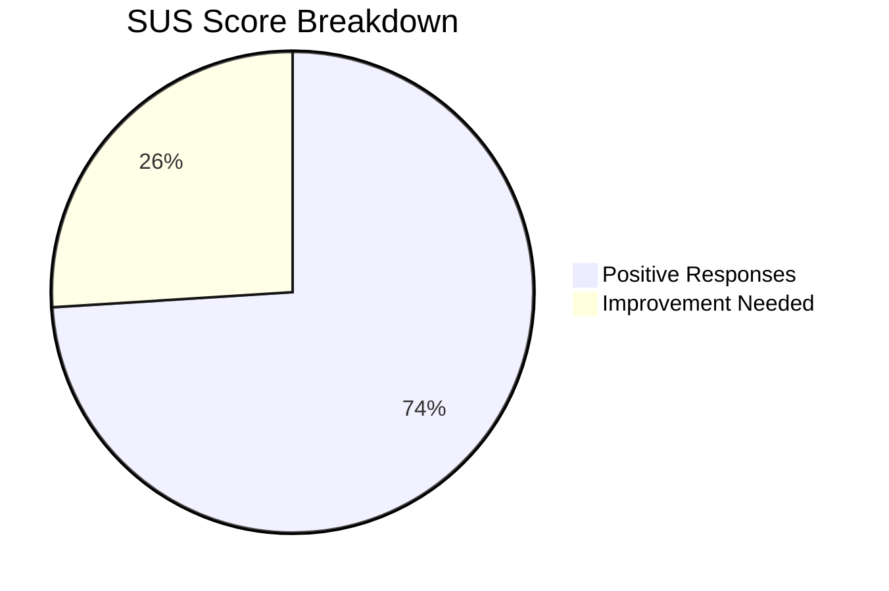

# Week 18: Usability Testing Round 1

**Date:** December 29, 2025 - January 3, 2026  
**Team:** Pooja Rani Maloth (2024204019), Jayant Anand Jha (2024204018)

---

## Objectives

- Conduct usability testing with 5 retail traders using the Figma prototype
- Measure task completion rates, comprehension, and user satisfaction
- Identify usability issues and areas of confusion
- Gather qualitative feedback on the AI narrative approach

## Activities

- **Test Recruitment:** Recruited 5 traders (mix of beginners and intermediates) from our interview contacts
- **Test Script Creation:** Prepared 5 task scenarios and post-test interview questions
- **Usability Sessions:** Conducted 30-minute moderated sessions via screen share
- **Data Analysis:** Compiled task success rates, error patterns, and qualitative feedback

## Research Findings

### Test Tasks & Results

| Task | Description | Success Rate | Avg Time | Issues Found |
|------|------------|-------------|----------|-------------|
| T1 | Read market summary and state if market is bullish/bearish | 5/5 (100%) | 8 sec | None -- narrative was immediately clear |
| T2 | Find the risk zone for strike 22,500 | 4/5 (80%) | 22 sec | 1 user looked in Chain view instead of Risk Map |
| T3 | Explain why a specific strike is marked as "Danger" | 5/5 (100%) | 15 sec | All users tapped the zone and read the explanation |
| T4 | Place a paper trade on a Safe zone strike | 3/5 (60%) | 45 sec | 2 users confused by Buy Call vs Buy Put terminology |
| T5 | Check paper trade P&L after simulated price change | 4/5 (80%) | 18 sec | 1 user didn't find the portfolio tab |

### Task Success Visualization

### Key Usability Issues Identified

| Issue | Severity | Affected Task | Fix |
|-------|----------|--------------|-----|
| Paper trade Buy/Sell terminology confuses beginners | High | T4 | Replace with "Bet Market Goes Up" / "Bet Market Goes Down" |
| Risk Map not discoverable from Chain view | Medium | T2 | Add risk zone indicator inline on chain rows |
| Portfolio tab in paper trading not obvious | Medium | T5 | Add "My Trades" shortcut on paper trade screen |
| Users wanted to know "What should I do?" not just "What is happening?" | High | General | Add optional actionable suggestion with disclaimer |
| Timestamp font too small on summary | Low | T1 | Increase from 10px to 12px |

### User Feedback Quotes

> "This is exactly what I needed. I can finally understand what OI means without googling." -- Participant 2

> "The red/yellow/green zones are genius. I immediately know where not to trade." -- Participant 4

> "I got confused at the paper trading part. 'Buy Call' doesn't mean anything to me. Just tell me if I'm betting up or down." -- Participant 3

> "Can you add a 'What should I do?' button? The explanation is great but I still don't know the next step." -- Participant 1

### System Usability Scale (SUS) Score

Average SUS score across 5 participants: **74/100** (Good -- above industry average of 68)

## Insights

- The core value proposition (AI narrative) tested extremely well -- 100% comprehension on market summary
- The paper trading flow has the most friction -- terminology is the barrier, not the concept
- Users want **actionable guidance**, not just interpretation. "The market is bearish" is helpful, but "Consider avoiding call buying at this level" is more useful. This needs careful handling to avoid SEBI compliance issues.
- The Risk Zone Map is the most beloved feature -- instant visual comprehension
- SUS score of 74 is encouraging for a first prototype, but the paper trading flow needs significant improvement

## Challenges

- Adding actionable suggestions ("What should I do?") creates regulatory risk -- we cannot give "investment advice" per SEBI regulations. Need to frame it as educational, not advisory.
- Paper trading terminology needs a complete redesign for beginners
- Sample size (N=5) is small -- findings are directional, not definitive

## Next Week Plan

- Begin technical implementation: set up backend, integrate data vendor APIs
- Apply usability fixes to the design before starting development
- Research SEBI compliance for "educational suggestions" vs "investment advice"
