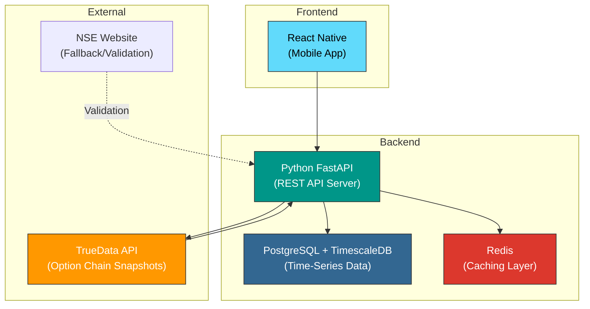
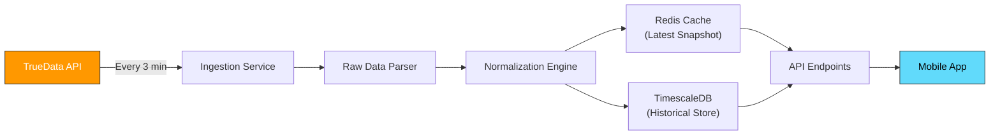

# Week 19: Technical Setup & Data Vendor Integration

**Date:** January 5 - January 10, 2026  
**Team:** Pooja Rani Maloth (2024204019), Jayant Anand Jha (2024204018)

---

## Objectives

- Set up the backend development environment and project structure
- Integrate with a licensed data vendor API for NSE option chain data
- Build the data ingestion and normalization pipeline
- Validate data quality and freshness against live market data

## Activities

- **Backend Setup:** Initialized Python FastAPI project with modular architecture
- **Data Vendor Evaluation:** Compared TrueData and Global Datafeeds APIs; selected TrueData for snapshot feeds
- **API Integration:** Built the data ingestion module to fetch and parse option chain snapshots
- **Data Normalization:** Created a normalization layer to standardize OI, COI, IV, PCR, and Volume data
- **Validation Testing:** Compared fetched data against NSE website to verify accuracy

## Research Findings

### Tech Stack Finalized

### Data Pipeline Architecture

### Data Schema (Key Fields)

| Field | Type | Description |
|-------|------|------------|
| `timestamp` | datetime | Snapshot time |
| `expiry_date` | date | Contract expiry |
| `strike_price` | integer | Strike level (e.g., 22500) |
| `call_oi` | integer | Call Open Interest |
| `call_coi` | integer | Call Change in OI |
| `call_iv` | float | Call Implied Volatility |
| `call_volume` | integer | Call traded volume |
| `put_oi` | integer | Put Open Interest |
| `put_coi` | integer | Put Change in OI |
| `put_iv` | float | Put Implied Volatility |
| `put_volume` | integer | Put traded volume |
| `underlying_price` | float | Current Nifty spot price |
| `pcr` | float | Computed Put-Call Ratio |

### Data Validation Results

| Metric | TrueData Value | NSE Website Value | Match |
|--------|---------------|-------------------|-------|
| Nifty Spot | 22,438.50 | 22,438.50 | Exact |
| 22500 CE OI | 1,24,350 | 1,24,350 | Exact |
| 22500 PE OI | 98,200 | 98,200 | Exact |
| PCR (computed) | 0.847 | 0.85 (approx) | Close |
| Data Latency | ~3 min | Real-time | Acceptable for MVP |

## Insights

- TrueData snapshot API provides reliable data with ~3 minute latency which is acceptable for our interpretation use case (we are not building an algo-trading tool that needs millisecond precision)
- TimescaleDB is excellent for time-series queries: "Show me how OI at strike 22500 changed over the last 2 hours" becomes a simple range query
- Redis caching ensures the mobile app gets instant responses for the latest snapshot -- no database query on every request
- Data normalization is critical: raw API returns numbers in different formats, units, and naming conventions

## Challenges

- TrueData free tier has rate limits -- need to optimize polling frequency
- Historical data backfill requires a separate data dump (extra cost)
- Need to handle market holidays and pre/post-market hours gracefully

## Next Week Plan

- Build the core interpretation engine: OI/COI pattern detection rules
- Implement the first set of interpretation rules based on domain knowledge
- Start translating patterns into structured insight objects
