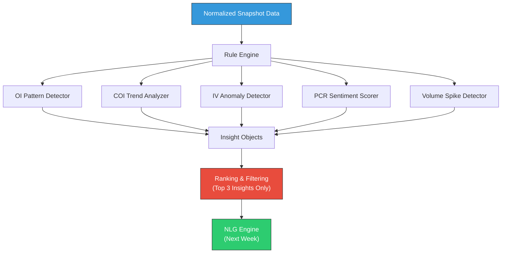
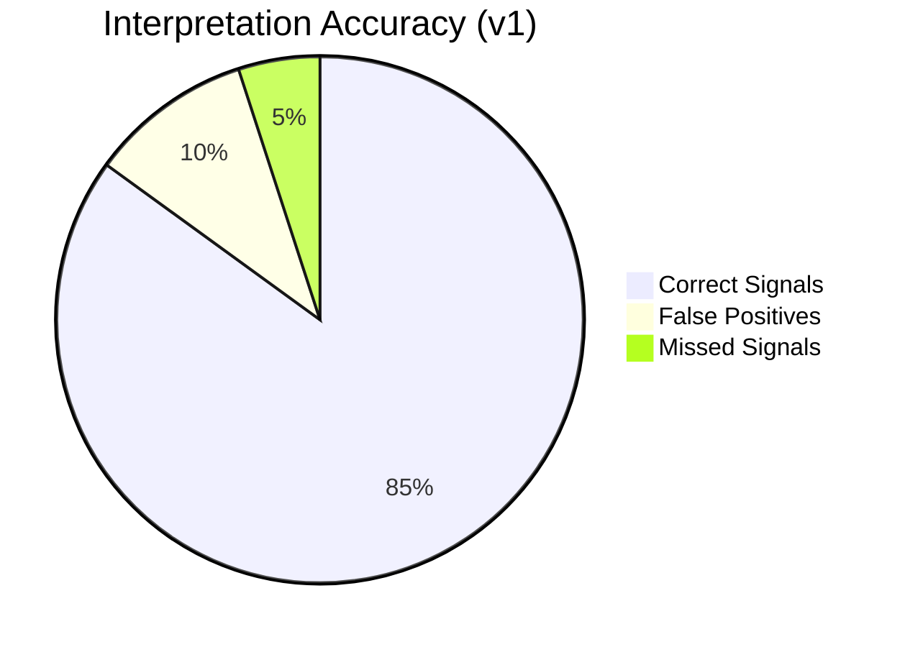

# Week 20: Core Interpretation Engine v1

**Date:** January 12 - January 17, 2026  
**Team:** Pooja Rani Maloth (2024204019), Jayant Anand Jha (2024204018)

---

## Objectives

- Build the core interpretation engine with rule-based pattern detection
- Implement detection rules for OI build-up, unwinding, short covering, and long build-up
- Create structured insight objects that can be consumed by the NLG layer
- Test interpretation accuracy against manual analysis

## Activities

- **Rule Engine Design:** Defined the interpretation rule framework with configurable thresholds
- **Pattern Detection Implementation:** Coded 12 core pattern detection rules for OI/COI analysis
- **Insight Object Schema:** Designed the structured output format for detected patterns
- **Accuracy Testing:** Compared engine output against Jayant's manual interpretation of 20 historical snapshots

## Research Findings

### Interpretation Rule Engine Architecture



### 12 Core Detection Rules Implemented

| Rule ID | Pattern | Detection Logic | Signal |
|---------|---------|----------------|--------|
| R1 | Heavy Call OI Build-up | Call OI increased >10% at a strike | Resistance forming |
| R2 | Heavy Put OI Build-up | Put OI increased >10% at a strike | Support forming |
| R3 | Call Unwinding | Call OI decreased with price falling | Resistance weakening |
| R4 | Put Unwinding | Put OI decreased with price rising | Support weakening |
| R5 | Short Covering (Calls) | Call OI decreasing + price rising | Bullish signal |
| R6 | Short Covering (Puts) | Put OI decreasing + price falling | Bearish signal |
| R7 | Long Build-up (Calls) | Call OI increasing + price rising | Strong bullish |
| R8 | Long Build-up (Puts) | Put OI increasing + price falling | Strong bearish |
| R9 | PCR Extreme Low | PCR < 0.7 | Oversold / bullish reversal possible |
| R10 | PCR Extreme High | PCR > 1.3 | Overbought / bearish reversal possible |
| R11 | IV Spike | IV increased >20% at a strike | High volatility expected |
| R12 | Max Pain Shift | Max pain level changed from previous session | Likely price magnet shifted |

### Insight Object Schema

```json
{
  "insight_id": "INS-20260117-001",
  "timestamp": "2026-01-17T10:30:00+05:30",
  "rule_triggered": "R1",
  "strike": 22500,
  "option_type": "CE",
  "pattern": "heavy_call_oi_buildup",
  "direction": "bearish",
  "confidence": 0.82,
  "severity": "high",
  "data": {
    "oi_current": 154200,
    "oi_previous": 128400,
    "oi_change_pct": 20.1,
    "iv": 14.5
  },
  "narrative_template": "resistance_forming"
}
```

### Accuracy Testing Results

Tested against 20 historical snapshots with Jayant's manual interpretation as ground truth:

| Metric | Result |
|--------|--------|
| True Positive Rate | 85% (17/20 correct signals identified) |
| False Positive Rate | 15% (3 false signals in edge cases) |
| Missed Signals | 10% (2 signals Jayant identified that engine missed) |
| Overall Agreement | 82% with manual expert analysis |



## Insights

- 85% accuracy in v1 is a strong starting point -- the 3 false positives occurred during low-volume pre-market hours where OI changes were noise, not signal
- The "Top 3 Insights Only" filter is crucial -- without it, the engine generates 15-20 insights per snapshot, which would overwhelm users (exactly what we're trying to avoid)
- Jayant's domain knowledge was essential for defining thresholds -- the 10% OI change threshold needs to be dynamic based on the strike's typical volume
- The insight object schema cleanly separates detection from narration, which will make the NLG layer much simpler

## Challenges

- Static thresholds don't work well across all market conditions -- a 10% OI change on an illiquid strike is meaningless, but on ATM strikes it's significant
- Need to add context-awareness: time of day, days to expiry, and proximity to current price all affect signal importance
- Edge cases during market open (9:15-9:30 AM) produce unreliable signals due to order matching volatility

## Next Week Plan

- Build the Natural Language Generation (NLG) engine
- Create narrative templates for all 12 rule types
- Implement the template selection and variable substitution system
