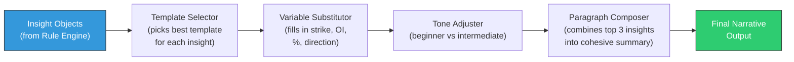

# Week 21: Natural Language Generation (NLG) Engine

**Date:** January 19 - January 24, 2026  
**Team:** Pooja Rani Maloth (2024204019), Jayant Anand Jha (2024204018)

---

## Objectives

- Build the NLG engine that converts structured insight objects into plain-language narratives
- Create narrative templates for all 12 detection rules
- Implement variable substitution, tone adjustment, and beginner-friendly language generation
- Test narrative quality with sample outputs

## Activities

- **Template System Design:** Built a template engine with variable slots, conditional phrases, and tone modifiers
- **Template Writing:** Wrote 24+ narrative templates (2+ variants per rule for natural variety)
- **Beginner Mode:** Added a "jargon-free" toggle that replaces technical terms with plain language
- **Market Summary Generator:** Built the composite narrative that combines top 3 insights into a single paragraph
- **Output Testing:** Generated narratives from 10 real historical snapshots and evaluated readability

## Research Findings

### NLG Engine Architecture

### Sample Narrative Outputs

**Example 1 -- Resistance Forming (Rule R1):**

*Technical version:*
> "Heavy call writing observed at 22,500 CE with OI increasing 20.1% to 1,54,200. This indicates strong institutional resistance at this level."

*Beginner version:*
> "Big traders are betting that Nifty will NOT go above 22,500. This level is acting like a ceiling -- the market may struggle to break through it."

**Example 2 -- Support Weakening (Rule R4):**

*Technical version:*
> "Put unwinding at 22,200 PE with OI declining 12% while price rises. Support at this level is weakening."

*Beginner version:*
> "The safety net at 22,200 is getting weaker. Traders who were protecting this level are pulling back. If the market falls, this level may not hold."

**Example 3 -- Composite Market Summary:**

> "Today's market shows a **bearish bias**. Big traders are building strong resistance at 22,500 (they don't expect the market to go above this). Meanwhile, the support at 22,200 is getting weaker as protective positions are being removed. The PCR of 0.85 confirms cautious sentiment. **Safest approach: Avoid buying calls above 22,400.**"

### Template Variables Available

| Variable | Description | Example |
|----------|------------|---------|
| `{strike}` | Strike price | 22,500 |
| `{oi_change_pct}` | OI change percentage | 20.1% |
| `{oi_current}` | Current OI value | 1,54,200 |
| `{option_type}` | CE or PE | CE |
| `{direction}` | Bullish, Bearish, Neutral | Bearish |
| `{pcr}` | Put-Call Ratio | 0.85 |
| `{confidence}` | Signal confidence | High/Medium/Low |
| `{support_level}` | Computed support | 22,200 |
| `{resistance_level}` | Computed resistance | 22,500 |

### Readability Scores

Tested generated narratives using Flesch-Kincaid readability:

| Mode | Flesch-Kincaid Grade | Target |
|------|---------------------|--------|
| Technical | Grade 12 (college level) | For intermediate traders |
| Beginner | Grade 7-8 (middle school) | For Priya & Arjun personas |

## Insights

- The beginner-mode narratives are transformative -- turning "Put unwinding at 22200 PE" into "The safety net at 22,200 is getting weaker" makes the data accessible to anyone
- Metaphors work incredibly well: "ceiling" for resistance, "safety net" for support, "big traders" for institutional activity
- The composite market summary is the highest-value output -- it replaces 30 minutes of manual analysis with a 10-second read
- Template variety (2+ per rule) prevents the narratives from feeling robotic

## Challenges

- Some market conditions are genuinely ambiguous -- the NLG engine struggles when signals conflict (e.g., bullish OI but bearish PCR). Need to handle "mixed signal" scenarios.
- Beginner language must be careful not to oversimplify to the point of being misleading
- The actionable suggestion ("Safest approach: Avoid buying calls above 22,400") needs SEBI compliance review

## Next Week Plan

- Build the Risk Zone Model -- the algorithm that classifies strikes into Safe/Caution/Danger
- Integrate the risk model with the interpretation engine and NLG output
