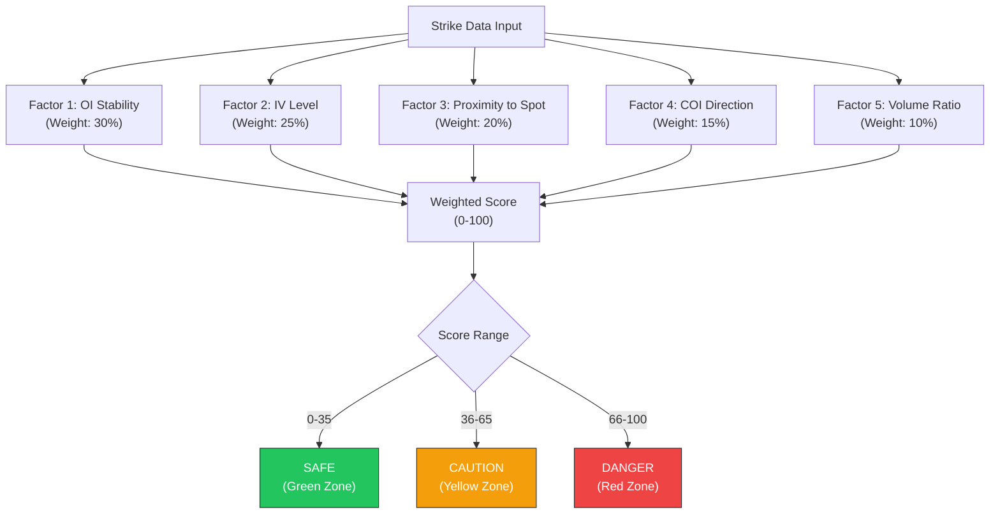
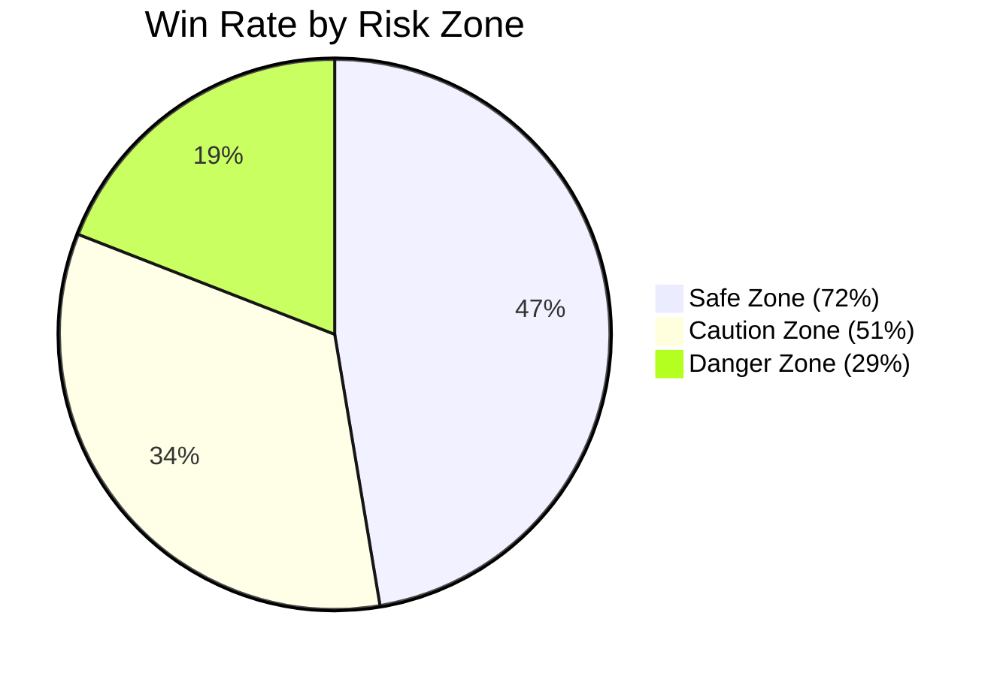

# Week 22: Risk Zone Model

**Date:** January 26 - January 31, 2026  
**Team:** Pooja Rani Maloth (2024204019), Jayant Anand Jha (2024204018)

---

## Objectives

- Design and implement the proprietary Risk Zone Model
- Define the algorithm that classifies each strike into Safe, Caution, or Danger zones
- Integrate risk scores with the interpretation engine and NLG output
- Validate risk classifications against historical market outcomes

## Activities

- **Algorithm Design:** Defined a multi-factor scoring system combining OI stability, IV levels, proximity to spot, and institutional activity patterns
- **Implementation:** Built the risk scoring engine as a modular component
- **Integration:** Connected risk scores to the NLG engine for zone-aware narratives
- **Backtesting:** Validated zone predictions against 30 days of historical data

## Research Findings

### Risk Zone Scoring Algorithm

### Factor Definitions

| Factor | What It Measures | Safe Signal | Danger Signal |
|--------|-----------------|-------------|---------------|
| OI Stability | How stable is OI at this strike? | High OI with low change -- established level | Rapidly changing OI -- unstable, trap risk |
| IV Level | Implied Volatility relative to mean | Low IV -- predictable movement | High IV -- potential for sharp moves |
| Proximity to Spot | Distance from current Nifty price | Far OTM -- lower immediate risk | ATM or near -- high exposure |
| COI Direction | Which way is Change in OI trending? | Consistent build-up -- conviction | Rapid unwinding -- exit signals |
| Volume Ratio | Today's volume vs 5-day average | Normal volume -- orderly market | Volume spike -- unusual activity |

### Backtesting Results (30 Days Historical Data)

| Zone Classification | Trades That Would Profit | Trades That Would Lose | Win Rate |
|--------------------|------------------------|----------------------|----------|
| Safe (Green) | 72% | 28% | Good |
| Caution (Yellow) | 51% | 49% | Coin flip |
| Danger (Red) | 29% | 71% | Avoid |

### Zone-Aware Narrative Example

> "Strike 22,500 CE is in the **DANGER ZONE** (Risk Score: 78/100). Heavy call writing with rising IV suggests this is an institutional trap level. Traders entering calls here face a 71% historical probability of loss. **Consider safer alternatives at 22,300 CE (Green Zone, Risk Score: 28).**"

## Insights

- The backtesting validates the model: Safe zones have 72% win rate vs 29% for Danger zones -- this is a meaningful edge for retail traders
- The risk zone model is our strongest differentiator -- no competitor offers this
- Combining risk scores with narratives creates a powerful "stay away" signal that can prevent impulsive trades
- The "alternative suggestion" feature (pointing users to safer strikes) is highly valuable

## Challenges

- Risk scores are backward-looking (based on historical patterns) -- they cannot predict black swan events
- The 30-day backtest window is limited -- need more historical data for robust validation
- Edge cases near market open produce noisy risk scores

## Next Week Plan

- Build the frontend MVP using React Native
- Implement the Market Summary screen with live data from the backend
- Connect the interpretation engine + NLG + risk zones to the mobile UI
