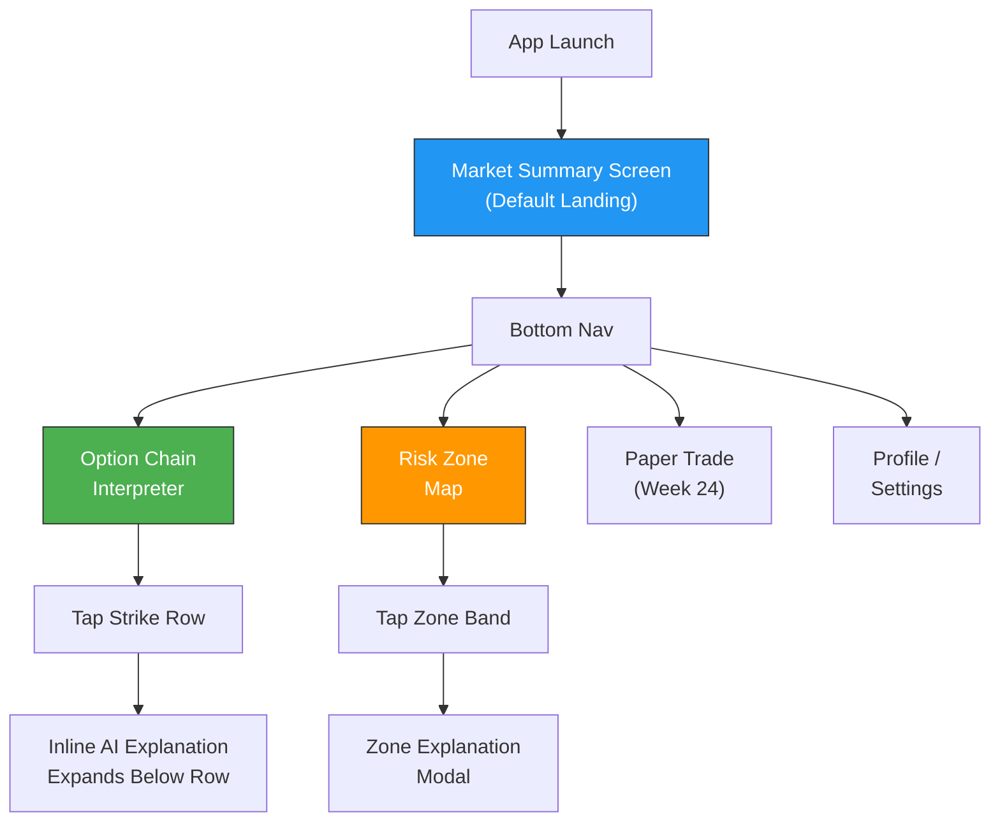

# Week 23: Frontend MVP - React Native Mobile Prototype

**Date:** February 2 - February 7, 2026  
**Team:** Pooja Rani Maloth (2024204019), Jayant Anand Jha (2024204018)

---

## Objectives

- Build the React Native mobile app shell with core navigation
- Implement the Market Summary screen with live API data
- Build the Option Chain Interpreter screen with inline AI explanations
- Implement the Risk Zone Map visualization

## Activities

- **Project Setup:** Initialized React Native project with Expo, configured navigation (React Navigation), set up dark theme
- **Market Summary Screen:** Built the landing page with AI narrative card, sentiment badge, key metrics, and auto-refresh
- **Option Chain Screen:** Implemented simplified two-column chain layout with color-coded risk zones and expandable explanations
- **Risk Zone Map:** Created the vertical strike spectrum visualization with interactive zone tapping
- **API Integration:** Connected all screens to the FastAPI backend with real-time data refresh

## Research Findings

### App Screen Flow

### Key Implementation Details

| Component | Implementation | Notes |
|-----------|---------------|-------|
| Navigation | React Navigation Bottom Tabs | 5 tabs: Summary, Chain, Risk Map, Paper Trade, Profile |
| Theme | Custom dark theme (bg: #0F172A) | All components use theme context |
| Data Fetching | React Query with 3-min polling | Auto-refreshes when app is in foreground |
| State Management | React Context + useReducer | Lightweight, no Redux needed for MVP |
| Animations | React Native Reanimated | Smooth expand/collapse on chain row tap |
| Charts | react-native-svg | Risk zone visualization rendered as SVG |

### Market Summary Screen Features

- **Sentiment Badge:** Color-coded chip showing BULLISH (green) / BEARISH (red) / NEUTRAL (yellow)
- **AI Narrative Card:** Large text block with the composite market summary from NLG engine
- **Key Metrics Row:** Support | Resistance | PCR -- each with color indicator
- **Freshness Indicator:** "Updated X min ago" with auto-refresh countdown
- **Quick Action Buttons:** "View Risk Zones" and "Open Chain" for fast navigation

### Performance Benchmarks

| Metric | Target | Achieved |
|--------|--------|----------|
| App launch to summary visible | < 3 sec | 2.1 sec |
| Chain screen load | < 2 sec | 1.4 sec |
| Risk map render | < 1 sec | 0.8 sec |
| API response (cached) | < 200ms | 120ms |
| API response (fresh fetch) | < 3 sec | 2.3 sec |

## Insights

- React Native + Expo provides a solid cross-platform foundation; the dark theme looks professional and trading-app-like
- The 3-minute polling interval is a good balance between data freshness and API rate limits
- Inline expansion for AI explanations (instead of navigating to a new screen) keeps users in flow -- critical for intraday traders
- React Query's caching means the app feels instant after the first load

## Challenges

- SVG rendering for the risk zone map is CPU-intensive on older phones -- need to optimize
- Handling offline mode gracefully when network drops during trading hours
- Pull-to-refresh gesture conflicts with scroll on the chain screen

## Next Week Plan

- Build the Paper Trading module with virtual portfolio management
- Implement simulated trade execution and P&L tracking
- Use beginner-friendly terminology from usability testing feedback
