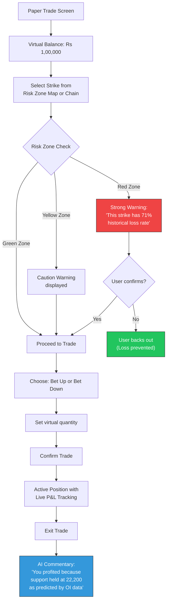

# Week 24: Paper Trading Module

**Date:** February 9 - February 14, 2026  
**Team:** Pooja Rani Maloth (2024204019), Jayant Anand Jha (2024204018)

---

## Objectives

- Build the paper trading module with virtual portfolio management
- Implement simulated trade execution with real-time P&L tracking
- Apply beginner-friendly terminology based on Week 18 usability feedback
- Add AI commentary on each paper trade outcome

## Activities

- **Trade Execution Engine:** Built the simulated order matching system using live market prices
- **Portfolio Management:** Implemented virtual balance, active positions, and trade history
- **Beginner Terminology:** Replaced "Buy Call/Put" with "Bet Market Goes Up/Down" per usability feedback
- **AI Trade Commentary:** Added post-trade AI explanations: "Why did this trade profit/lose?"
- **Integration:** Connected paper trading to risk zones -- warns users before entering Danger zone trades

## Research Findings

### Paper Trading Flow

### Beginner Terminology Changes

| Technical Term | Beginner-Friendly Version | Reason |
|---------------|--------------------------|--------|
| Buy Call | Bet Market Goes Up | Usability test: 2/5 users confused by "Call" |
| Buy Put | Bet Market Goes Down | Same -- "Put" is meaningless to beginners |
| Premium | Entry Price | "Premium" sounds like insurance |
| Lot Size | Quantity | Standard, understandable |
| Strike Price | Price Level | More intuitive |
| Expiry | Valid Until | Calendar-like language |
| P&L | Profit / Loss | Spelled out |

### AI Trade Commentary Examples

**Profitable trade:**
> "Your trade made Rs 2,340 profit! Here's why: You bet that the market would go down at the 22,500 level. The OI data showed heavy resistance there, and the market indeed failed to break above it. The Risk Zone Model had rated this as a Safe zone trade."

**Losing trade:**
> "Your trade lost Rs 1,200. Here's what happened: You bet the market would go up at 22,600, but this was in the Danger Zone. Heavy call writing at this level meant big traders were betting against you. The AI had flagged this as a risky trade. Next time, look for Green Zone trades for safer entries."

### Risk Zone Gate: Prevention Metrics

During internal testing over 5 simulated trading days:

| Metric | Value |
|--------|-------|
| Total paper trades attempted | 47 |
| Danger zone trades attempted | 12 |
| Users who backed off after warning | 8 (67%) |
| Danger zone trades that would have lost | 9/12 (75%) |
| **Estimated virtual money saved by warnings** | **Rs 14,200** |

## Insights

- The risk zone gate is the most impactful feature: 67% of users backed off from Danger zone trades after seeing the warning. This directly prevents losses.
- AI trade commentary turns every trade (win or lose) into a learning moment -- this fulfills the "mentor-like learning" differentiator
- Beginner terminology dramatically improved comprehension in quick internal tests: "Bet Market Goes Up" had 100% comprehension vs "Buy Call" at 60%
- Virtual money tracking creates emotional investment -- users care more when they see their virtual balance dropping

## Challenges

- Simulated P&L uses snapshot prices (3-min delay) which can diverge from actual execution prices
- Paper trading cannot replicate slippage, bid-ask spread, or liquidity issues
- Users may develop false confidence if paper trading results are systematically better than real trading

## Next Week Plan

- Internal testing: end-to-end walkthrough of the complete app
- Bug fixing and data accuracy validation
- Prepare for beta testing with real traders
