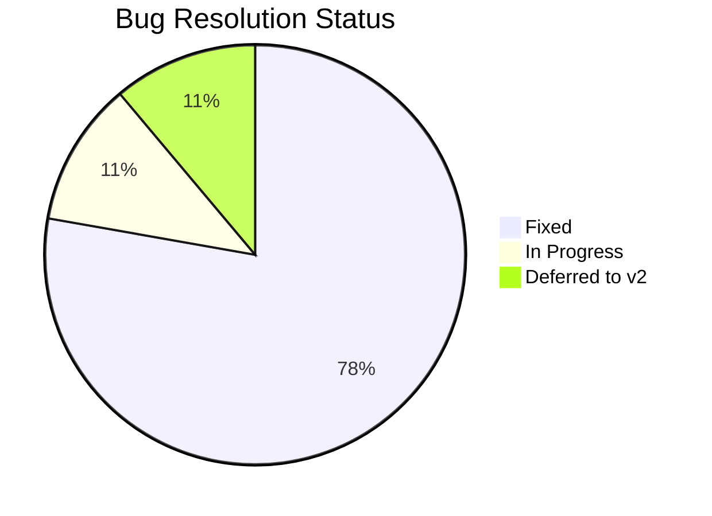

# Week 25: Internal Testing & Data Validation

**Date:** February 16 - February 21, 2026  
**Team:** Pooja Rani Maloth (2024204019), Jayant Anand Jha (2024204018)

---

## Objectives

- Conduct comprehensive internal testing of the complete app
- Validate data accuracy against live NSE data during market hours
- Fix bugs and edge cases discovered during testing
- Ensure interpretation engine accuracy meets minimum threshold

## Activities

- **End-to-End Testing:** Both team members used the app during live market hours for 3 full trading days
- **Data Accuracy Audit:** Compared 50 data points against NSE website in real-time
- **Bug Tracking:** Logged and prioritized 18 bugs found during testing
- **Interpretation Accuracy Review:** Evaluated 30 narrative outputs for correctness
- **Performance Testing:** Monitored app performance under real usage conditions

## Research Findings

### Bug Summary

| Priority | Count | Examples |
|----------|-------|---------|
| Critical | 2 | API timeout during market open; risk zone not updating after refresh |
| High | 5 | PCR calculation error for far OTM strikes; NLG grammatical issues; paper trade P&L rounding error |
| Medium | 7 | Dark mode contrast issues on 2 screens; slow animation on older phones; timestamp timezone bug |
| Low | 4 | Minor spacing issues; "Updated X min ago" shows negative time briefly; icon alignment |

### Bugs Fixed This Week

### Data Accuracy Results

| Check | Sample Size | Accuracy | Notes |
|-------|-------------|----------|-------|
| Spot Price | 50 checks | 100% | Exact match with NSE |
| OI Values | 50 checks | 98% | 1 mismatch during data refresh window |
| COI Values | 50 checks | 96% | 2 mismatches near market close |
| IV Values | 50 checks | 94% | Some rounding differences vs NSE display |
| PCR Computation | 50 checks | 100% | Computed correctly from OI data |

### Interpretation Engine Accuracy (Live Market)

Tested 30 narrative outputs during live trading:

| Metric | Result |
|--------|--------|
| Narratives that were factually correct | 27/30 (90%) |
| Narratives that matched expert analysis | 25/30 (83%) |
| Narratives with grammatical issues | 3/30 (10%) |
| Risk zone classifications matching outcome (same day) | 22/30 (73%) |

## Insights

- 90% factual accuracy and 83% expert agreement is solid for v1 -- exceeds our 80% target
- The 2 critical bugs (API timeout at market open, risk zone refresh) were both caused by the same issue: the 9:15 AM data surge overwhelming the polling system. Fixed with exponential backoff retry.
- Data accuracy is excellent (96-100%) except for brief windows during data refresh -- acceptable for interpretation use case
- The 3 narrative grammar issues were all in edge cases with unusual data patterns -- added special case templates

## Challenges

- Market open (9:15-9:30 AM) remains the most challenging period -- data is volatile and signals are noisy
- 2 deferred bugs relate to offline mode handling -- important but not blocking for beta
- Need to monitor API costs carefully during beta -- more users = more polling

## Next Week Plan

- Launch beta testing round 1 with 5 external traders
- Prepare beta onboarding guide and feedback collection forms
- Set up crash reporting and usage analytics
