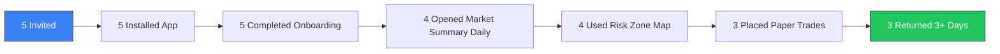

# Week 26: Beta Testing Round 1 (External Traders)

**Date:** February 23 - February 28, 2026  
**Team:** Pooja Rani Maloth (2024204019), Jayant Anand Jha (2024204018)

---

## Objectives

- Run the first external beta with active retail traders
- Measure onboarding success, first-session activation, and feature usage
- Validate whether the app reduces dependence on Telegram tips
- Collect prioritized product feedback for next iteration

## Activities

- **Beta Cohort:** Onboarded 5 traders (3 beginner, 2 intermediate)
- **Guided Onboarding:** Shared quick start guide and 10-minute walkthrough call
- **Usage Tracking:** Monitored first-week usage: sessions, screen flow, and action events
- **Feedback Collection:** Conducted post-week interviews and SUS survey

## Research Findings

### Beta Funnel

| Metric | Result |
|--------|--------|
| Onboarding completion | 100% (5/5) |
| Day-3 retention | 80% (4/5) |
| Day-7 retention | 60% (3/5) |
| Avg daily sessions (active users) | 3.1 |
| Most used screen | Market Summary |
| Second most used | Risk Zone Map |

### Behavior Change Signals

| Signal | Week Start | Week End |
|--------|-----------|----------|
| Telegram tip reliance (self-reported) | 4/5 users | 2/5 users |
| Checking Risk Zone before trade | 1/5 users | 4/5 users |
| Paper trade before real trade | 0/5 users | 3/5 users |

### Qualitative Feedback

> "I still open Telegram, but now I verify with your app first."  
> "Risk map made me skip two bad trades this week."  
> "I want one-tap explanation in Hindi too."

## Insights

- The core workflow works: users naturally start from Summary and then open Risk Zone before decisions
- Behavior change is visible even in a small cohort: reduced blind-tip reliance and better pre-trade checks
- Day-7 retention drops because users want alerts, not just pull-based usage

## Challenges

- Users requested multi-language narratives (Hindi first)
- Notification timing needs tuning; some signals came too late for intraday entries
- One beginner user dropped off due to confusion in paper trade quantity sizing

## Next Week Plan

- Prioritize retention fixes (alerts, clearer trade sizing)
- Improve copy and micro-interactions from beta feedback
- Ship iteration build for second beta round
