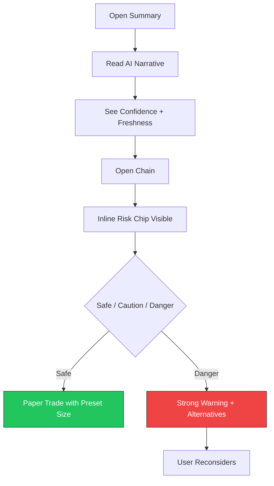

# Week 27: Iteration Sprint Based on Beta-1 Feedback

**Date:** March 2 - March 7, 2026  
**Team:** Pooja Rani Maloth (2024204019), Jayant Anand Jha (2024204018)

---

## Objectives

- Address top usability and retention issues from Beta-1
- Improve notification relevance and timing
- Simplify paper trading quantity and execution flow
- Improve narrative clarity and trust messaging

## Activities

- **UX Iterations:** Updated interaction copy and reduced friction in 6 key paths
- **Alerts v1.1:** Added configurable alert windows (every 3 min, 5 min, 10 min)
- **Paper Trade UX:** Replaced raw lot-size input with guided quantity presets
- **Narrative Enhancements:** Added confidence label and data freshness tag

## Research Findings

### Prioritized Fixes Delivered

| Area | Problem from Beta-1 | Fix Implemented | Impact Expectation |
|------|----------------------|-----------------|--------------------|
| Notifications | Alerts too late / noisy | Alert cadence + threshold tuning | Better day-7 retention |
| Paper Trading | Quantity confusion | Presets: Small / Medium / Large | Fewer failed trade attempts |
| Narrative Trust | "How fresh is this?" | Added `Updated X min ago` + confidence | More confidence in action |
| Risk Clarity | Some users skipped zone details | Inline zone chip in chain rows | Higher risk-check usage |

### Updated User Flow

## Insights

- Copy changes had outsized impact: replacing technical labels improved comprehension immediately
- Confidence labels reduce overtrust and undertrust simultaneously (users calibrate better)
- Guided quantity presets removed the biggest paper-trade friction point

## Challenges

- Alert tuning remains tricky: reducing noise can miss short-lived opportunities
- Some intermediate users asked for advanced mode toggles (v2 scope)

## Next Week Plan

- Run Beta-2 with expanded cohort
- Compare Beta-2 metrics against Beta-1 baseline
- Validate whether retention and trade hygiene improved
