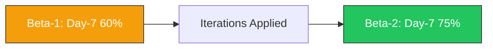

# Week 28: Beta Testing Round 2 (Expanded Cohort)

**Date:** March 9 - March 14, 2026  
**Team:** Pooja Rani Maloth (2024204019), Jayant Anand Jha (2024204018)

---

## Objectives

- Validate iteration changes from Week 27 with a larger user cohort
- Benchmark retention and task success against Beta-1
- Evaluate perceived trust, clarity, and confidence improvements
- Identify final must-fix items before final review

## Activities

- **Cohort Expansion:** Tested with 8 users (5 beginners, 3 intermediate)
- **Comparative Analysis:** Tracked the same KPIs used in Beta-1 for direct comparison
- **Scenario Testing:** Ran common market scenarios (range day, trend day, volatile day)
- **Feedback Interviews:** Conducted short end-of-week debrief calls

## Research Findings

### Beta-1 vs Beta-2 Comparison

| KPI | Beta-1 | Beta-2 | Change |
|-----|--------|--------|--------|
| Onboarding completion | 100% | 100% | No change |
| Day-3 retention | 80% | 87.5% | +7.5% |
| Day-7 retention | 60% | 75% | +15% |
| Risk-zone check before trade | 80% | 87.5% | +7.5% |
| Paper-trade completion success | 60% | 87.5% | +27.5% |
| Avg SUS score | 74 | 82 | +8 |

### User Confidence Outcomes

| Prompt | Positive Response |
|--------|-------------------|
| "I understand market direction faster now" | 7/8 |
| "Risk colors help me avoid bad entries" | 8/8 |
| "I trust app explanations more than random tips" | 6/8 |
| "I would continue using this weekly" | 7/8 |

## Insights

- Iteration sprint worked: strongest gains came from paper-trade simplification and clearer risk signaling
- Retention improved meaningfully, suggesting product utility goes beyond first-use novelty
- Users increasingly use the app as a verification layer before acting on external tips

## Challenges

- Advanced users still ask for optional deeper analytics (should be additive, not default)
- Narrative freshness depends on snapshot frequency; real-time plans remain a cost decision

## Next Week Plan

- Final bug and polish sprint
- Stabilize build for final demo
- Prepare narrative and evidence pack for end-term review
