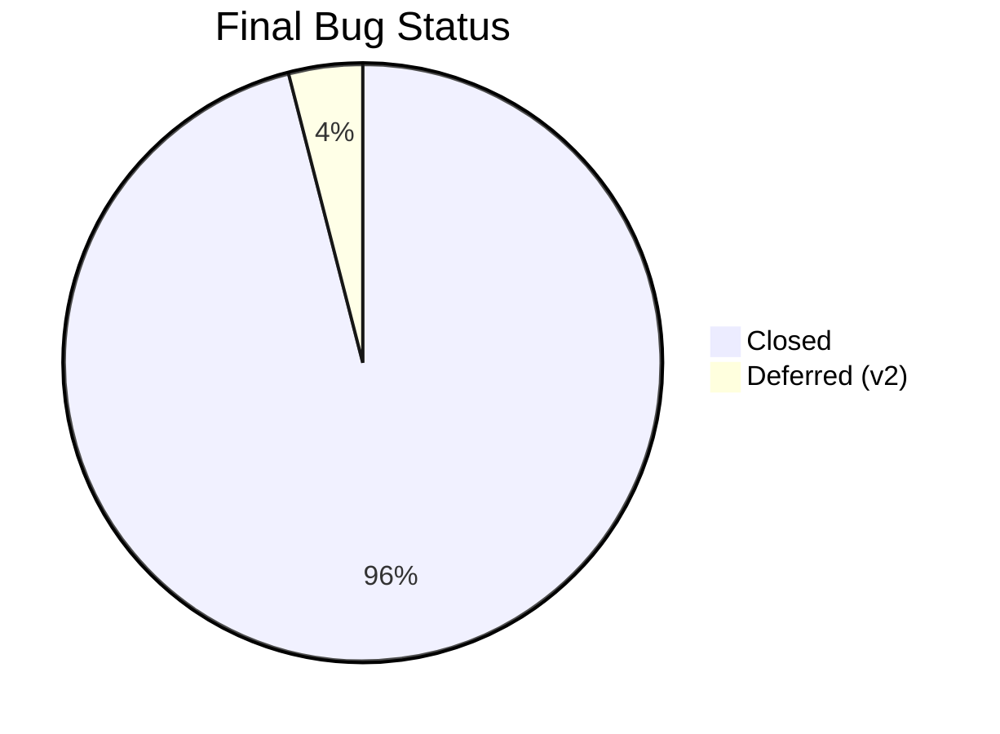

# Week 29: Final Refinements & Performance Optimization

**Date:** March 16 - March 21, 2026  
**Team:** Pooja Rani Maloth (2024204019), Jayant Anand Jha (2024204018)

---

## Objectives

- Complete final polish of MVP before end-term review
- Optimize performance for slower devices and unstable networks
- Close all blocking bugs and freeze scope
- Prepare a stable demo build

## Activities

- **Performance Pass:** Reduced API payload size and optimized screen re-renders
- **Stability Fixes:** Closed remaining high-priority bugs from beta tracking
- **UI Polish:** Improved contrast, spacing consistency, and empty/error states
- **Scope Freeze:** Locked v1 features and moved extras to v2 backlog

## Research Findings

### Performance Improvements

| Metric | Before | After | Improvement |
|--------|--------|-------|-------------|
| App cold start | 2.1s | 1.6s | 24% faster |
| Summary refresh | 2.3s | 1.7s | 26% faster |
| Chain screen interaction delay | 220ms | 130ms | 41% lower latency |
| Risk map render | 0.8s | 0.5s | 37% faster |

### Stability Status

### v1 Scope Freeze

| Included in v1 | Deferred to v2 |
|----------------|----------------|
| AI market summary | Multi-language narratives |
| Option chain interpretation | Advanced strategy builder |
| Risk zone classification | Broker integration |
| Paper trading with virtual portfolio | Real-money trade journaling |
| Confidence + freshness indicators | Personalized AI coaching |

## Insights

- The product now feels production-like for demo purposes: fast enough, stable enough, and clear enough
- Scope freeze was essential to avoid last-week regressions
- Most requested enhancements are additive and do not undermine core v1 value

## Challenges

- Keeping v1 minimal while still satisfying advanced-user requests
- Ensuring demo reliability under variable network during presentation

## Next Week Plan

- Final documentation and storytelling for end-term evaluation
- Record product walkthrough and prepare evidence-backed demo script
