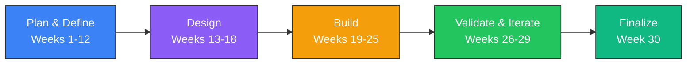

# Week 30: End-Term Documentation & Demo Preparation

**Date:** March 23 - March 28, 2026  
**Team:** Pooja Rani Maloth (2024204019), Jayant Anand Jha (2024204018)

---

## Objectives

- Consolidate complete semester evidence from discovery to MVP
- Prepare end-term presentation narrative and demo flow
- Document measurable outcomes from testing rounds
- Finalize next-phase roadmap

## Activities

- **Evidence Consolidation:** Compiled interview findings, usability results, beta metrics, and accuracy stats
- **Demo Script:** Designed a 7-minute product walkthrough from pain point to solution outcome
- **Slide Prep:** Structured story: Problem -> Insight -> Design -> Build -> Validate -> Impact
- **Roadmap Draft:** Defined post-course continuation plan and research extensions

## Research Findings

### End-to-End Project Arc

### Final Outcome Summary

| Area | Result |
|------|--------|
| Problem validation | Strong (SEBI data + interviews + observed behavior) |
| UX clarity | Improved (SUS 74 -> 82) |
| Interpretation accuracy | 90% factual correctness in internal testing |
| Risk guidance usefulness | Strong user agreement in beta rounds |
| Behavioral shift | Reduced blind tip dependence in beta cohort |

### Demo Flow for Evaluation

1. Show "Interpretation Gap" moment on raw option chain
2. Open app summary narrative and explain sentiment quickly
3. Navigate to risk map and show safe vs danger strikes
4. Place paper trade using guided flow
5. Show trade commentary and learning loop
6. Close with measured impact and roadmap

## Insights

- The strongest proof point is not just feature completion; it is measurable decision-quality improvement
- Narrative-first UX consistently outperformed chart-first paradigms for target users
- The product's real strength is reducing confusion at the exact moment users are likely to make poor choices

## Challenges

- Need larger and longer beta windows for stronger statistical confidence
- Real-time feed and compliance guardrails require further engineering and legal diligence

## Next Week Plan

- Submit final artifacts and presentation
- Package repository for faculty review
- Start planning v2 experiments (language support, adaptive risk scoring)
